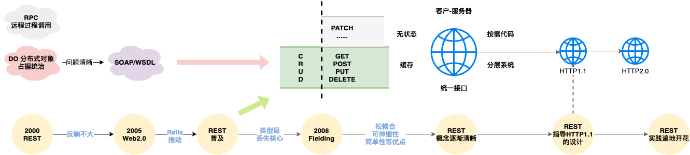

## REST in Practice

REST发展进程

### 一、互联网应用架构约束

- 客户-服务端
- 无状态
- 缓存
- 统一接口
- 分层系统
- 按需代码

### 二、时间线

1. 2000年,Fielding发表博士论文，提出REST的概念。当时的市场还充斥这DO这种架构风格，一时没有很大反响(REST-- Representation State Transfer 表现层状态转换)
2. 2005年，Web2.0崛起，当时EJB/DCOM/SOAP等架构的问题慢慢显现，由于不满足互联网应用架构的部分约束，因而很难融入Web之中，因而将目光转向REST，并发起了一场运动
3. 这场运动被Rudy on Rails开发框架的大力推动，因而推动了REST开发的普及
4. REST的应用局限于CRUD，收窄了REST的适用范围，也失去了REST风格的核心理念
5. 2008年10月，Fielding看到了REST的乱象后，发表博文，描述"REST APIs must be hypertext-driven",必须是超文本驱动
6. 接下去几年，REST有了很好的理解与应用，由于REST风格的定义比较严苛，实用主义者，根据Richardson的评价REST风格API所处层级的成熟度模型，使用不同层级的RESTful
7. REST从最初用来指导HTTP1.1等Web基础协议和规范的设计，到后来用来指导Web浏览器、Web服务器、Http代理服务等Web基础设施的开发，再到知道Web应用的架构设计，进行企业应用领域
