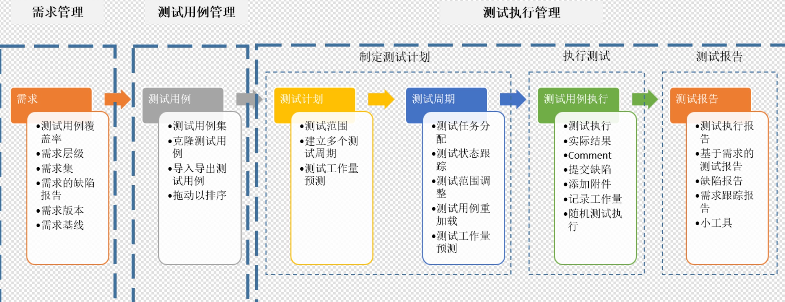

## Jira SynapseRT For Test Case

- [官方基础知识](https://doc.goldfingerholdings.com/synapsert/latest/zh_cn/synapsert-ver-9-x)

## 一、功能介绍

> synapseRT做为一个JIRA插件可以大大增强JIRA对于软件需求管理和软件测试管理的功能；

- 它能够帮助开发团队在软件项目中高效，方便的协作；
- 能够帮助测试团队方便快捷的组织测试用例和计划，执行测试；
- 同时将需求和测试用例，测试结果完美的结合在一起，使整个项目团队在各阶段计划、构建和发布更好的软件产品；

1. 功能模块

它主要包括以下4个模块：

- 测试用例管理（将开展使用）
- 测试执行管理（将开展使用）
- 测试自动化
- 需求管理（将开展使用）

2. 工作流程

为了使您更加容易的理解synapseRT在JIRA中的工作方式，我们推荐您按照以下的典型工作流程来配置和管理您的需求和测试：

- 在JIRA中创建需求；
- 直接从需求中创建测试用例以保证需求被测试所覆盖，或者您可以链接已有的测试用例到需求；
- 通过测试用例集来组织测试用例，为测试用例创建树形结构；
- 创建测试计划并且从测试用例集中挑选需要执行的测试用例；
- 为测试计划创建测试周期；
- 启动（开始）测试周期，为测试用例指派测试者（项目成员）；
- 测试者开始测试执行，发现缺陷时直接从测试执行中创建或者链接缺陷；
- 通过不同的测试报告查看测试结果。

## 二、相关责任人说明

|序号|内容|负责人|
|--|--|--|
|1|本次迭代相关测试用例|QA指定（非功能开发人员优先）|
|2|本次迭代相关测试计划|每次项目迭代，产生迭代的测试计划，测试计划不存在，由本次迭代QA编写,计划下相关测试周期，由本次QA制定并开启,测试计划内测试用例/测试周期内测试用例，需要QA根据本次迭代内容进行添加与调整|
|3|	周期内测试用例的执行|QA计划中，分配的功能验证审核负责人|
|4|相关测试报表|QA负责生成周期报表，测试执行报表等|

## 三、测试计划/测试用例命名规范 

请遵循以下命名规范
- 测试计划：[项目简称]-[Sprint]-功能测试计划，例如：DMP-Sprint 9/11~9/29 功能测试计划
- 测试用例：【模块名称】子功能描述，例如：【用户分群】新建用户分群

## 四、测试步骤

### 步骤一 创建测试用例

>此处我们编写的测试用例，类似于测试场景，不需要太多的正反例的测试用例，避免过多工作。

根据QA计划，编写尚未建立的测试用例。

1. 以下是两个常见的测试用例建立入口
- 从JIRA创建测试用例
- 从测试用例集创建测试用例

2. 新建页面如下，需要选择问题类型：【测试用例】，并填写表单中内容，对测试用例进行基础的描述

3. 如果你在为新功能或bug编写测试用例，确保将测试用例与story或bug关联

### 步骤二 创建测试用例集

>测试用例集是测试用例的逻辑分组，一个测试用例可以出现在多个测试用例集中，测试用例集可以包含其他测试用例集。我们建议按功能模块把测试用例组织成树形结构。

>测试用例集可以在以后复用，当我们修改了一个模块，可以把相关的测试用例集添加到本次测试计划中。

1. 点击右侧Test Suite标签栏，进入测试用例集管理页
2. 点击Add，添加测试用例集
3. 填写名称后，点击Add
4. 选中新建的测试用例集，点击编辑图标
5. 在测试用例集管理页中，你可以添加测试用例集或者测试用例
6. 最后把测试用例组织成树形结构

### 步骤三 创建测试计划

> 你可以在多个sprint之间复用同一个计划，也可以每个sprint单独创建一个测试计划，每个sprint只有一个测试计划。

>每个sprint开始后，QA和产品经理需要指定本次迭代的测试计划，编写相关的测试用例。

【更多说明】

> [什么是测试计划’的说明](https://doc.goldfingerholdings.com/synapsert/latest/zh_cn/synapsert-ver-9-x/user-guide/test-execution-management/test-plan-issue)

> [如何制定测试计划的说明](https://doc.goldfingerholdings.com/synapsert/latest/zh_cn/synapsert-ver-9-x/user-guide/test-execution-management/test-plan-issue)

1. 点击新建，Issue Type选为 测试计划
2. 在新建完测试计划后，点击添加测试用例集
3. 确保当前迭代的任务都绑定相关测试用例
4. 勾选当前迭代任务覆盖的测试用例(集)，或想要的测试用例(集)
5. 此时测试用例已经被添加到了计划中

### 步骤四 根据Sprint 测试计划，制定测试周期

> 创建测试周期的目的是为了将在测试计划中选择的同一组测试用例在不同的开发版本和测试环境组合中多次执行。

>每个测试周期可以针对不同的环境做测试，以DMP举例，需要3个测试周期，分别对应本地环境(可选)，预发布环境以及正式环境。

1. 创建测试周期
2. 填写相关测试
3. 类似地，添加预发布和产线的测试周期，绑定Sprint与开始结束时间

### 步骤五 执行测试

1. 在开发任务完成后，开启测试周期
2. 点击测试周期名
进入测试周期后，如果当前迭代中的任务都绑定了相关测试用例（集），则能够在右侧显示相关任务的测试覆盖情况
3. 在弹出框中点击Execute，执行测试用例
4. 对于每个测试步骤，填写结果和描述，截图
5. 如果某个步骤失败，点击右侧+创建bug
- 建立BUG，统一选择类型
- 新建BUG必须填写优先级
- 优先级可选用：Highest、High、Medium、Low、Lowest
- 如果其他人在随机测试情况（即不是本迭代当前用例指定的测试人）发现并建立了BUG，可以点击链接按钮，绑定指定BUG；
- 如果有附件需要提交，可以点击附件按钮进行添加；
6. 右侧可以查看当前测试周期的执行情况
- 点击 【15 Defect(s)】,能够快速查看当前测试周期中发现的BUG列表
7. 一轮测试周期结束，在确认测试点都完成填写结果后，需要QA负责人手动将其结束
- 此外，如果当前测试计划下的测试周期都已结束，需要QA手动修改测试计划状态为【完成】

### 步骤六 查看测试报表

1. 进入测试报表
2. 选择Test Execution Based Reports
3. 选择测试计划和测试周期（测试周期可不选，这样会列出该测试计划的所有测试结果）
4. 点击Generate Report
5. 这里可以看到当前测试计划/测试周期的统计情况
6. 查看bug列表

