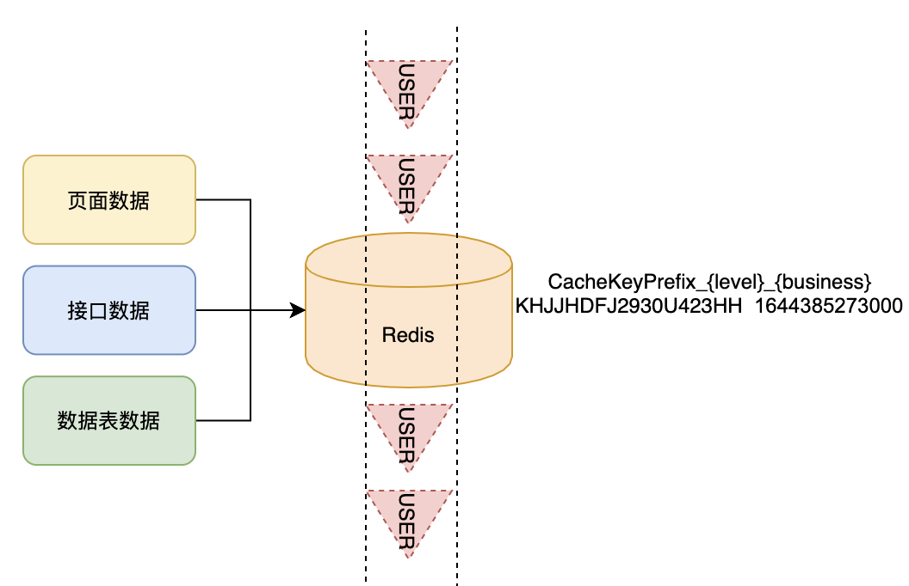

## 中台实践：企业级通用化黑名单平台2

- 以下将简单描述企业轻量级亿级别黑名单过滤机制
- 业务场景：针对划分黑名单等级、配置黑名单策略的营销渠道，进行日量级百万的业务运营，需要过滤亿级别黑名单

## 一、黑名单的存储

- 主要使用Redis的哈希结构进行黑名单的存储
- HashKey根据黑名单等级+业务划分，{keyPrefix}-{level}-{business}的形式
- hash内部key为用户的唯一标识
- hash内部value存储用户入黑名单的时间，用于数据的过期淘汰
- 以上存储在业务逻辑上相对清晰，可能在内存存储、hash内key的膨胀等方面还具有一定的优化空间

## 二、黑名单的更新

- 黑名单的更新存在两个部分，实时反馈的黑名单（页面新增/修改的部分，接口同步的部分），分日更新的黑名单（每日周期性更新）
- 实时反馈的黑名单，按照接收到的数据进行组装更新对象，通过分布式队列异步提交和消费的方式，进行数据的更新
- 分日更新的黑名单，按照分表进行进行写入和读取，对于新增/更新标识的数据行进行分批处理

## 三、黑名单的过滤

- 根据缓存的渠道配置的黑名单策略：等级+业务+选取的天数，拼接出需要过滤的redis hashkey
- 针对每个redis haskey 进行用户的过滤
- 如果存储黑名单中，校验时间字段是否在配置的范围
- 如果在范围中，是黑名单
- 如果不在范围中，不是黑名单
- 如果未存储在黑名单中，不是黑名单
- 使用异步流式多线程的实现方式，进行较大量级的黑名单过滤操作

