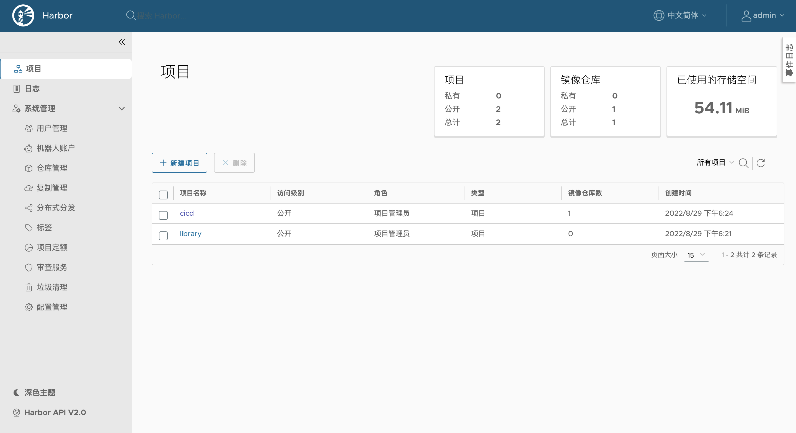

## Docker Harbor 私仓实践

### 背景

由于期望搭建一个企业级CICD的环境，开始尝试常规的gitlab+jenkins+k8s+docker harbor+springboot开始练手

其中版本如下：

1.gitlab: GitLab Community Edition 12.2.1 
2.jenkins: 
3.Mac kubernetes: v1.24.2
4.Mac docker: Engine: 20.10.17 Compose: 1.29.2
5.harbor:  v2.5.1-b0506782


### 前提

企业级代码库 Gitlab
企业级CICD持续化集成工具 Jenkins
企业级容器化技术架构：Docker+Kubernetes

以下就开始搭建Harbor，构造企业级私有化镜像仓库

为什么选择Harbor？因为它的功能相对较强，能够基本满足企业级运作

上图先浅看一下


### 使用离线包进行手动安装

请注意需要安装在有Docker指令的机器上

#### 下载资源包

从 github releases 官方下载offline离线包，这边选取一个稳定版本v2.5.1（online版本需要在线去持续下载资源，为了避免失败，直接下载离线包更为简单）

```bash
#通过wget
wget https://github.com/goharbor/harbor/releases/download/v2.5.1/harbor-online-installer-v2.5.1.tgz

#通过页面
#直接点击Asserts中harbor-online-installer-v2.5.1.tgz 下载即可
```

#### 解压并配置

tgz的包直接解压

```bash
tar zxf harbor-online-installer-v2.5.1.tgz ./harbor
```

解压出来后的目录结构：

```text
-rw-r--r--@ 1 chenzy  staff      11347  5 26 23:59 LICENSE
drwxr-xr-x  3 chenzy  staff         96  8 29 18:20 common
-rw-r--r--@ 1 chenzy  staff       3361  5 26 23:59 common.sh
-rw-r--r--  1 chenzy  staff       6057  8 30 08:25 docker-compose.yml
-rw-r--r--@ 1 chenzy  staff  664492716  5 27 00:00 harbor.v2.5.1.tar.gz
-rw-r--r--@ 1 chenzy  staff       9917  5 26 23:59 harbor.yml.tmpl
-rwxr-xr-x@ 1 chenzy  staff       2500  5 26 23:59 install.sh
-rwxr-xr-x@ 1 chenzy  staff       1881  5 26 23:59 prepare
```

脚本有prepare install common三个，其中common是基础脚本，我们只会直接调用prepare和install两个脚本

其中harbor.yml.tmpl为核心配置的模板，我们可以直接修改文件名称，或者拷贝一个文件来作为核心配置文件，文件内容如下：

```bash
# Configuration file of Harbor

# The IP address or hostname to access admin UI and registry service.
# DO NOT use localhost or 127.0.0.1, because Harbor needs to be accessed by external clients.
# 以下主要填写仓库的IP或域名，最好为域名形式
hostname: 127.0.0.1

# http related config
# 以下为HTTP的配置形式
http:
  # port for http, default is 80. If https enabled, this port will redirect to https port
  # 默认80，基本是要调整
  port: 18080

# https related config
# 以下为HTTPs的配置形式，正常生产环境需要打开，需要配置https证书
#https:
  # https port for harbor, default is 443
  #port: 443
  # The path of cert and key files for nginx
  #certificate: /your/certificate/path
  #private_key: /your/private/key/path

# # Uncomment following will enable tls communication between all harbor components
# internal_tls:
#   # set enabled to true means internal tls is enabled
#   enabled: true
#   # put your cert and key files on dir
#   dir: /etc/harbor/tls/internal

# Uncomment external_url if you want to enable external proxy
# And when it enabled the hostname will no longer used
# external_url: https://reg.mydomain.com:8433

# The initial password of Harbor admin
# It only works in first time to install harbor
# Remember Change the admin password from UI after launching Harbor.
# 以下是Harbor admin的默认密码，可修改
harbor_admin_password: Harbor123

# Harbor DB configuration
database:
  # The password for the root user of Harbor DB. Change this before any production use.
  # 内置DB的默认密码
  password: root123
  # The maximum number of connections in the idle connection pool. If it <=0, no idle connections are retained.
  max_idle_conns: 100
  # The maximum number of open connections to the database. If it <= 0, then there is no limit on the number of open connections.
  # Note: the default number of connections is 1024 for postgres of harbor.
  max_open_conns: 900

# The default data volume
# 挂载的目录
data_volume: /files/docker/harbor

# Harbor Storage settings by default is using /data dir on local filesystem
# Uncomment storage_service setting If you want to using external storage
# storage_service:
#   # ca_bundle is the path to the custom root ca certificate, which will be injected into the truststore
#   # of registry's and chart repository's containers.  This is usually needed when the user hosts a internal storage with self signed certificate.
#   ca_bundle:

#   # storage backend, default is filesystem, options include filesystem, azure, gcs, s3, swift and oss
#   # for more info about this configuration please refer https://docs.docker.com/registry/configuration/
#   filesystem:
#     maxthreads: 100
#   # set disable to true when you want to disable registry redirect
#   redirect:
#     disabled: false

# Trivy configuration
#
# Trivy DB contains vulnerability information from NVD, Red Hat, and many other upstream vulnerability databases.
# It is downloaded by Trivy from the GitHub release page https://github.com/aquasecurity/trivy-db/releases and cached
# in the local file system. In addition, the database contains the update timestamp so Trivy can detect whether it
# should download a newer version from the Internet or use the cached one. Currently, the database is updated every
# 12 hours and published as a new release to GitHub.
trivy:
  # ignoreUnfixed The flag to display only fixed vulnerabilities
  ignore_unfixed: false
  # skipUpdate The flag to enable or disable Trivy DB downloads from GitHub
  #
  # You might want to enable this flag in test or CI/CD environments to avoid GitHub rate limiting issues.
  # If the flag is enabled you have to download the `trivy-offline.tar.gz` archive manually, extract `trivy.db` and
  # `metadata.json` files and mount them in the `/home/scanner/.cache/trivy/db` path.
  skip_update: false
  #
  # The offline_scan option prevents Trivy from sending API requests to identify dependencies.
  # Scanning JAR files and pom.xml may require Internet access for better detection, but this option tries to avoid it.
  # For example, the offline mode will not try to resolve transitive dependencies in pom.xml when the dependency doesn't
  # exist in the local repositories. It means a number of detected vulnerabilities might be fewer in offline mode.
  # It would work if all the dependencies are in local.
  # This option doesn’t affect DB download. You need to specify "skip-update" as well as "offline-scan" in an air-gapped environment.
  offline_scan: false
  #
  # insecure The flag to skip verifying registry certificate
  insecure: false
  # github_token The GitHub access token to download Trivy DB
  #
  # Anonymous downloads from GitHub are subject to the limit of 60 requests per hour. Normally such rate limit is enough
  # for production operations. If, for any reason, it's not enough, you could increase the rate limit to 5000
  # requests per hour by specifying the GitHub access token. For more details on GitHub rate limiting please consult
  # https://developer.github.com/v3/#rate-limiting
  #
  # You can create a GitHub token by following the instructions in
  # https://help.github.com/en/github/authenticating-to-github/creating-a-personal-access-token-for-the-command-line
  #
  # github_token: xxx

jobservice:
  # Maximum number of job workers in job service
  max_job_workers: 10

notification:
  # Maximum retry count for webhook job
  webhook_job_max_retry: 10

chart:
  # Change the value of absolute_url to enabled can enable absolute url in chart
  absolute_url: disabled

# Log configurations
log:
  # options are debug, info, warning, error, fatal
  level: info
  # configs for logs in local storage
  local:
    # Log files are rotated log_rotate_count times before being removed. If count is 0, old versions are removed rather than rotated.
    rotate_count: 50
    # Log files are rotated only if they grow bigger than log_rotate_size bytes. If size is followed by k, the size is assumed to be in kilobytes.
    # If the M is used, the size is in megabytes, and if G is used, the size is in gigabytes. So size 100, size 100k, size 100M and size 100G
    # are all valid.
    rotate_size: 200M
    # The directory on your host that store log
    location: /var/log/harbor

  # Uncomment following lines to enable external syslog endpoint.
  # external_endpoint:
  #   # protocol used to transmit log to external endpoint, options is tcp or udp
  #   protocol: tcp
  #   # The host of external endpoint
  #   host: localhost
  #   # Port of external endpoint
  #   port: 5140

#This attribute is for migrator to detect the version of the .cfg file, DO NOT MODIFY!
_version: 2.5.0

# Uncomment external_database if using external database.
# external_database:
#   harbor:
#     host: harbor_db_host
#     port: harbor_db_port
#     db_name: harbor_db_name
#     username: harbor_db_username
#     password: harbor_db_password
#     ssl_mode: disable
#     max_idle_conns: 2
#     max_open_conns: 0
#   notary_signer:
#     host: notary_signer_db_host
#     port: notary_signer_db_port
#     db_name: notary_signer_db_name
#     username: notary_signer_db_username
#     password: notary_signer_db_password
#     ssl_mode: disable
#   notary_server:
#     host: notary_server_db_host
#     port: notary_server_db_port
#     db_name: notary_server_db_name
#     username: notary_server_db_username
#     password: notary_server_db_password
#     ssl_mode: disable

# Uncomment external_redis if using external Redis server
# external_redis:
#   # support redis, redis+sentinel
#   # host for redis: <host_redis>:<port_redis>
#   # host for redis+sentinel:
#   #  <host_sentinel1>:<port_sentinel1>,<host_sentinel2>:<port_sentinel2>,<host_sentinel3>:<port_sentinel3>
#   host: redis:6379
#   password: 
#   # sentinel_master_set must be set to support redis+sentinel
#   #sentinel_master_set:
#   # db_index 0 is for core, it's unchangeable
#   registry_db_index: 1
#   jobservice_db_index: 2
#   chartmuseum_db_index: 3
#   trivy_db_index: 5
#   idle_timeout_seconds: 30

# Uncomment uaa for trusting the certificate of uaa instance that is hosted via self-signed cert.
# uaa:
#   ca_file: /path/to/ca

# Global proxy
# Config http proxy for components, e.g. http://my.proxy.com:3128
# Components doesn't need to connect to each others via http proxy.
# Remove component from `components` array if want disable proxy
# for it. If you want use proxy for replication, MUST enable proxy
# for core and jobservice, and set `http_proxy` and `https_proxy`.
# Add domain to the `no_proxy` field, when you want disable proxy
# for some special registry.
proxy:
  http_proxy:
  https_proxy:
  no_proxy:
  components:
    - core
    - jobservice
    - trivy

# metric:
#   enabled: false
#   port: 9090
#   path: /metrics

# Trace related config
# only can enable one trace provider(jaeger or otel) at the same time,
# and when using jaeger as provider, can only enable it with agent mode or collector mode.
# if using jaeger collector mode, uncomment endpoint and uncomment username, password if needed
# if using jaeger agetn mode uncomment agent_host and agent_port
# trace:
#   enabled: true
#   # set sample_rate to 1 if you wanna sampling 100% of trace data; set 0.5 if you wanna sampling 50% of trace data, and so forth
#   sample_rate: 1
#   # # namespace used to differenciate different harbor services
#   # namespace:
#   # # attributes is a key value dict contains user defined attributes used to initialize trace provider
#   # attributes:
#   #   application: harbor
#   # # jaeger should be 1.26 or newer.
#   # jaeger:
#   #   endpoint: http://hostname:14268/api/traces
#   #   username:
#   #   password:
#   #   agent_host: hostname
#   #   # export trace data by jaeger.thrift in compact mode
#   #   agent_port: 6831
#   # otel:
#   #   endpoint: hostname:4318
#   #   url_path: /v1/traces
#   #   compression: false
#   #   insecure: true
#   #   timeout: 10s

# enable purge _upload directories
upload_purging:
  enabled: true
  # remove files in _upload directories which exist for a period of time, default is one week.
  age: 168h
  # the interval of the purge operations
  interval: 24h
  dryrun: false
```

#### 将Harbor仓库地址配置在Docker的代理仓库地址中

找到自己当前部署Docker daemon.json所在目录

```bash
cat /etc/docker/daemon.json
{
  "registry-mirrors": ["https://docker.mirrors.ustc.edu.cn"],
  "insecure-registries" : ["127.0.0.1:18080"]
}
```

配置保存后，需要重新加载启动一下Docker服务使其生效

#### 启动Harbor

```bash
#使用当前目录下install指令即可启动
./install.sh
```

如果修改了harbor.yml则需要先执行 prepare指令，再执行install指令

此外还可以在系统上将服务固定下来，不用手动启动，将其设置为基于docker服务的系统服务

```text
[Unit]
Description=Harbor
After=docker.service systemd-networkd.service systemd-resolved.service
Requires=docker.service
Documentation=http://github.com/vmware/harbor

[Service]
Type=simple
Restart=on-failure
RestartSec=5
ExecStart=/usr/local/bin/docker-compose -f  [harbor dir]/docker-compose.yml up      ##中括号部分修改成harbor的文件夹
ExecStop=/usr/local/bin/docker-compose -f [harbor dir]/docker-compose.yml down      ##中括号部分修改成harbor的文件夹

[Install]
WantedBy=multi-user.target
```

#### 校验仓库的登录与推送

```bash
# 一、使用页面登录，直接输入 127.0.0.1:18080的地址，即可出现登录页，可使用配置文件中的admin密码进行设置

# 二、使用指令验证
a@b:/etc/docker$ docker login 127.0.0.1:18080
Authenticating with existing credentials...
Login Succeeded

#制作镜像
docker tag nginx:latest 127.0.0.1:18080/cicd/nginx:latest
#查看镜像
a@b:/etc/docker$ docker images
REPOSITORY                                                TAG                                                                          IMAGE ID       CREATED         SIZE
127.0.0.1:18080/cicd/nginx                                latest                                                                       2b7d6430f78d   6 days ago      142MB
#推送镜像
a@v:/etc/docker$  docker push 127.0.0.1:18080/cicd/nginx:latest
The push refers to repository [127.0.0.1:18080/cicd/nginx]
73993eeb8aa2: Pushed 
2c31eef17db8: Pushed 
7b9055fc8058: Pushed 
04ab349b7b3b: Pushed 
226117031573: Pushed 
6485bed63627: Pushed 
latest: digest: sha256:89020cd33be2767f3f894484b8dd77bc2e5a1ccc864350b92c53262213257dfc size: 1570

#最终能够在页面查看到对应仓库中的镜像
```
