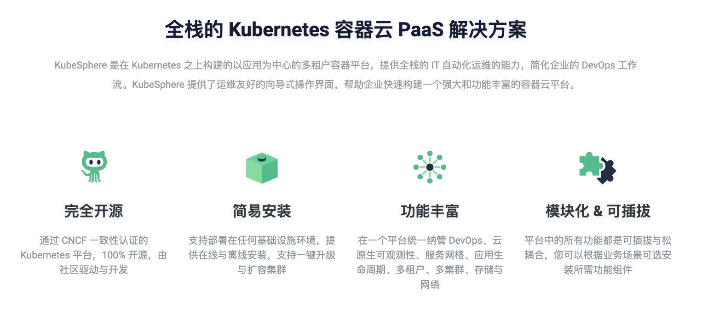
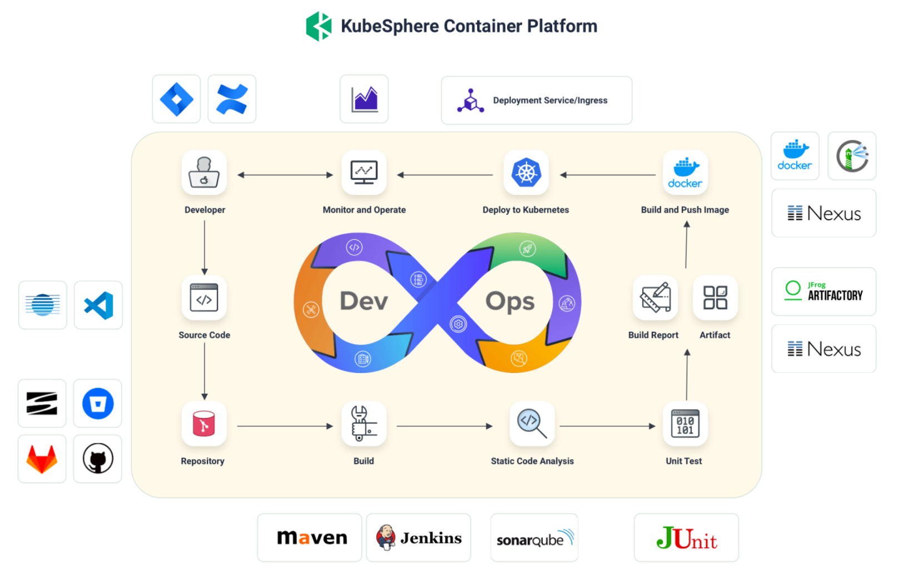

date： 2023-12-22
location：西交利物浦大学

全文概要:

- [Section-1 Agile-头部智能电动车公司敏捷转型实践分享](#section-1-agile-头部智能电动车公司敏捷转型实践分享)
- [Section-2 KubeSphere 可插拔架构下 DevOps 插件实现方法](#section-2-kubesphere-可插拔架构下-devops-插件实现方法)
- [Section-3 KubeSphere 在 vsleem 的落地实践](#section-3-kubesphere-在-vsleem-的落地实践)
- [Section-4 Zabbix+SkyWalking 实现全域监控](#section-4-zabbixskywalking-实现全域监控)
- [Section-5 AI 时代的战略思维](#section-5-ai-时代的战略思维)
- [Section-6 闪电演讲 —— 在校学生如何参与开源项目](#section-6-闪电演讲--在校学生如何参与开源项目)

**>> Background**
**什么是KubeSphere?**
KubeSphere 是在 Kubernetes 之上构建的面向云原生应用的分布式操作系统，完全开源，支持多云与多集群管理，提供全栈的 IT 自动化运维能力，简化企业的 DevOps 工作流。它的架构可以非常方便地使第三方应用与云原生生态组件进行即插即用 (plug-and-play) 的集成。
开源地址：https://github.com/kubesphere/kubesphere

什么是敏捷？
敏捷是一种通过创造变化和响应变化在不确定和混乱的环境中取得成功的能力。

----

## Section-1 Agile-头部智能电动车公司敏捷转型实践分享

此部分，俞老师主要介绍了自身再给企业做敏捷规划的过程中，敏捷的过程方法对目前提效降本的大环境的重要性
过程中，也有小伙伴提出了很多实际业务开展中的很多问题和难点：

1. 敏捷在职能型团队如何开展，开展的困难性
2. 从运维角度出发，为开发团队提出敏捷思想的建议，但难于推广
3. 敏捷的阶段和目标不那么明确或者是优先级不明的多任务同步推进，敏捷的周期目标、周期交付成果的界限就逐步模糊化，敏捷的过程就逐步扭曲了

## Section-2 KubeSphere 可插拔架构下 DevOps 插件实现方法

此部分，主要有KubeSphere开源工程师余老师介绍，着重讲述KubeSphere DevOps部分功能以及迭代的历程。

DevOps主要涵盖：
1. 功能需求管理(JIRA/WIKI)
2. 源代码(Source Code)
3. 代码管理工具(Github/Gitlab...)
4. 构建【CI工具(Jenkins...)->CD功能(ArgoCD...)】
5. 代码质量检查(Code Analysis)
6. 测试(UT)
7. 构建报告
8. 镜像推送
9. K8S部署
10. 监控与运维

讲述在KubeSphere 3.x时代，CI/CD流程主要依赖 Jenkins + ArgoCD 来完成，但是逐渐意识到对更多CI/CD框架的需求，此外KubeSphere 还面临着版本发布周期较长、组件耦合、社区扩展繁琐等问题，为了应对上述问题，在 4.0 版本引入了全新的微内核架构，代号为 “LuBan”。

不局限于原来的选型，支持前后端动态扩展，使得默认安装的 KubeSphere 变得更加轻量。

新的架构，对于使用者、贡献者、维护者来说，都是一个好消息。

## Section-3 KubeSphere 在 vsleem 的落地实践

此部分，是方老师开讲。主要讲述KubeSphere部分功能在企业落地情况，对于AllInOne部署、云边架构一体化、多集群管理给公司的快速开发、生产带来了极大便利。

## Section-4 Zabbix+SkyWalking 实现全域监控

此部分，陈老师主要就如何针对开源项目Zabbix、SkyWalking等深度协同二开做全域可观测提出企业级实践介绍。

主要是针对公司产品Argus对于Skywalking开源工具的理解、运用、二开、数据存储优化展开介绍。

其中除了讲解基于Skywalking开源功能的介绍，还描述了对于ElasticSearch转ClickHouse的大改造。主要考虑在成千上万的探针数据采集监控的业务场景下，ES集群的使用开销逐步提升，在降本提速的大要求下，将ES爆改CK，对指标字符串字典化存储，将文档数据转为列式数字数据存储，显著提升整体存储性能、降低占用存储、减少服务节点。

## Section-5 AI 时代的战略思维

此部分，主要有西交利物浦副教授张老师展开，就AI时代背景下，从顶层战略思维的角度来看企业面临的新挑战和内部决策机制。

从人为的主观的决策，到大数据分析辅助的决策，到目前AI分析辅助的决策。

随着时代的变化，战略思维也需要适时而变，吸收更多维度的数据与辅助建议，来做出更为科学的决策。

## Section-6 闪电演讲 —— 在校学生如何参与开源项目

此部分，主要是苏科大的一位大四学生，分享开源项目是什么？为什么？怎么做？

呼吁更多的学生，将兴趣作为导师，参与到开源项目中，实现自己的价值。
