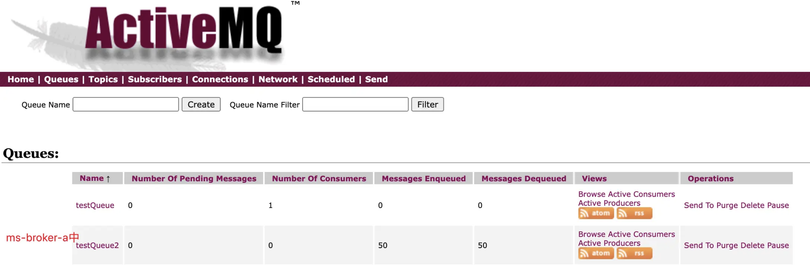
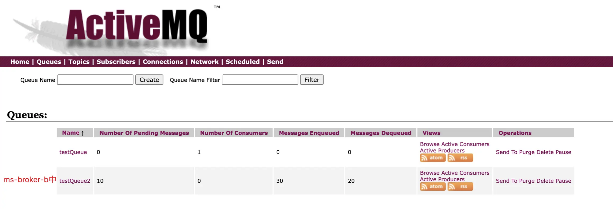
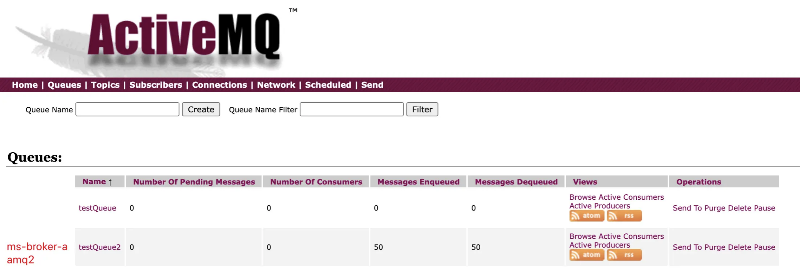
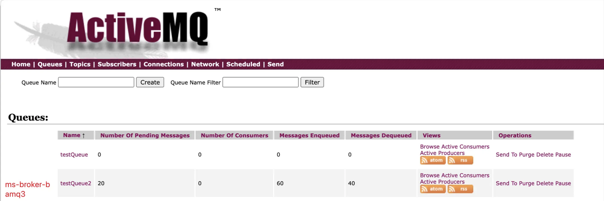

集群架构是一个很大的话题，官网就给我们介绍了几种

- [客户端：队列消费者集群-Queue Consumer Clusters](#客户端队列消费者集群-queue-consumer-clusters)
- [服务端：Broker集群 - Broker Clusters](#服务端broker集群---broker-clusters)
  - [静态发现](#静态发现)
  - [动态发现](#动态发现)
- [服务端：Master-Slave 主从集群](#服务端master-slave-主从集群)
  - [Shared File System Master Slave](#shared-file-system-master-slave)
  - [JDBC Master Slave](#jdbc-master-slave)
  - [Replicated LevelDB Store(no longer supported)](#replicated-leveldb-storeno-longer-supported)
- [Broker-Cluster+Master Slave的组合](#broker-clustermaster-slave的组合)

## 客户端：队列消费者集群-Queue Consumer Clusters

竞争消费者模式，https://www.enterpriseintegrationpatterns.com/patterns/messaging/CompetingConsumers.html

对于点对点的队列模式（不是发布订阅模式），针对无状态的消息，多个消费者可以扩大消费者的处理能力。

对于有状态的消息而言，从ActiveMQ生产者的角度，发出的消息是能够遵循顺序的，单一的消费者就是顺序消费，如果是多个消费者并发消费，那么顺序就将被破坏。

从ActiveMQ解决方案看

- 第一就是控制同一时间只有一个消费者来保证消费的顺序
- 第二是通过消息组来保证组内消费是顺序的，组间依旧是负载均衡

## 服务端：Broker集群 - Broker Clusters

JMS 上下文中最常见的集群模型就是一组 JMS broker，客户端去连接去中一个，只要有一个无法提供服务了，就自动连到其他节点。

因此ActiveMQ就提供了`failover://`的客户端连接方式。客户端配置使用静态发现(写死地址配置)或动态发现(支持自动配置), 一旦一个broker无法服务就会自动连接到另一个。

这个动作仅仅在客户端侧，但是如果多个broker是不相通没有联系的，那么消息生产者依旧投递，异常的broker上数据仍然会堆积。目前解决方案就是创建一个网络来存储和转发这些消息，避免消息再发到异常的broker上。

客户端配置使用静态发现或动态发现是依托Broker之间的网络，来支持自动的故障转移和发现

静态发现和动态发现就是两种配置模式，差异不大。

Broker-Cluster的模式在实际生产应用中其实也是一个不错的选择，靠节点之间协同消费，来提升整体的性能，但是如果某个节点挂机，并且数据已经被持久化到对应的节点后，可能会导致部分数据堆积在故障节点上

### 静态发现

配置固定可连接的地址，是生产中常用的配置方式

```xml
<networkConnectors>
    <networkConnector uri="static:(tcp://other-broker:port)" duplex="false"/>
</networkConnectors>
```

比如：

```xml
<!--amq1.acitvemq.xml中-->
  <networkConnectors>
    <networkConnector uri="static:(tcp://amq1:61616)" duplex="false"/>
  </networkConnectors>

<!--amq2.acitvemq.xml中-->
  <networkConnectors>
     <networkConnector uri="static:(tcp://amq2:61616)" duplex="false"/>
  </networkConnectors>
```

互为备份，我中有你，你中有我。

多个节点还可以是  

```xml
<!--amq1.acitvemq.xml中-->
<networkConnectors></networkConnectors>

<!--amq2.acitvemq.xml中-->
<networkConnectors>
    <networkConnector uri="static:(tcp://amq1:61616)" duplex="true"/>
</networkConnectors>

<!--amq3.acitvemq.xml中-->
<networkConnectors>
    <networkConnector uri="static:(tcp://amq1:61616,tcp://amq2:61618)" duplex="true"/>
</networkConnectors>
```

`<transportConnectors>`节点都是正常配置即可。

关于`duplex`的配置，这个参数是全双工的含义，代表双端可以同时进行双向传输，就如平时的在电话中通话那样。如果非全双工的，那么你连我或者我连你，类似计算机和打印机之间的通信是单工模式，只有计算机向打印机传输数据，而没有相反
方向的数据传输。

- 如果 `duplex=true` 那在brokerA配置，即可双端确认连接，brokerB就不需要再配置了
- 如果 `duplex=false` 这是默认的情况，两边 `activemq.xml` 文件下都需要配置，以确保两边可通信

### 动态发现

通过组播的形式，获取可连接地址，需要调整 `<transportConnectors>` 和 `<networkConnectors>` 两个地方

```xml
<broker name="foo">
  <transportConnectors>
    <transportConnector name="openwire" uri="tcp://0.0.0.0:61616?maximumConnections=1000&amp;wireFormat.maxFrameSize=104857600" discoveryUri="multicast://default"/>
  </transportConnectors>

  ...

  <networkConnectors>
    <networkConnector uri="multicast://default"/>
</networkConnectors>
</broker>

```

着重就是在 `uri` 和 `discoveryUri` 的配置上。

## 服务端：Master-Slave 主从集群

主从集群有分为两种：

- 一种是通过共享文件实现主从集群，一般通过共享挂载目录或存储实现，默认是KahaDB。主要通过多个节点同时抢占文件锁，但仅有一个节点可以获取文件锁的形式，从而保证只有一个主其他多个从待命。
- 一种是通过JDBC数据库存储的方式实现共享的主从集群，配置会稍微繁琐些，并且服务的性能受数据库性能影响。主要通过多个节点同时抢占数据库锁资源，但仅有一个节点可以获取锁，从而保证只有一个主其他从待命。

### Shared File System Master Slave

通过共享的文件系统，实现主从集群，主节点通过故障转移自动恢复查询新的主节点。

共享的文件系统是通过底层的文件锁实现的，首先要确保能够有文件锁。

使用 `docker-compose` 配置后，启动服务能够发现，多个节点会同时启动，但是最终仅有一个节点能够拿到锁，并正常启动完整服务，对外提供服务。

```log
amq1    |  INFO | Using Persistence Adapter: KahaDBPersistenceAdapter[/opt/apache-activemq/data/kahadb]
amq1    |  INFO | Starting Persistence Adapter: KahaDBPersistenceAdapter[/opt/apache-activemq/data/kahadb]
amq1    |  INFO | Database /opt/apache-activemq/data/kahadb/lock is locked by another server. This broker is now in slave mode waiting a lock to be acquired
amq2    |  INFO | Using Persistence Adapter: KahaDBPersistenceAdapter[/opt/apache-activemq/data/kahadb]
amq2    |  INFO | Starting Persistence Adapter: KahaDBPersistenceAdapter[/opt/apache-activemq/data/kahadb]
amq2    |  INFO | Database /opt/apache-activemq/data/kahadb/lock is locked by another server. This broker is now in slave mode waiting a lock to be acquired
amq3    |  INFO | Starting Temp Data Store
amq3    |  INFO | PListStore:[/opt/apache-activemq/data/sharedfilesystem_mastersalve/tmp_storage] started
amq3    |  INFO | Starting Job Scheduler Store
amq3    |  INFO | Persistence Adapter successfully started
amq3    |  INFO | Apache ActiveMQ 6.0.1 (sharedfilesystem_mastersalve, ID:amq3-32923-1710911682404-0:1) is starting
amq3    |  INFO | Listening for connections at: tcp://amq3:61616?maximumConnections=1000&wireFormat.maxFrameSize=104857600
amq3    |  INFO | Connector openwire started
amq3    |  INFO | Listening for connections at: amqp://amq3:5672?maximumConnections=1000&wireFormat.maxFrameSize=104857600
amq3    |  INFO | Connector amqp started
amq3    |  INFO | Listening for connections at: stomp://amq3:61613?maximumConnections=1000&wireFormat.maxFrameSize=104857600
amq3    |  INFO | Connector stomp started
amq3    |  INFO | Listening for connections at: mqtt://amq3:1883?maximumConnections=1000&wireFormat.maxFrameSize=104857600
amq3    |  INFO | Connector mqtt started
amq3    |  INFO | Starting Jetty server
amq3    |  INFO | Creating Jetty connector
amq3    |  WARN | ServletContext@o.e.j.s.ServletContextHandler@51d719bc{/,null,STARTING} has uncovered HTTP methods for the following paths: [/]
amq3    |  INFO | Listening for connections at ws://amq3:61614?maximumConnections=1000&wireFormat.maxFrameSize=104857600
amq3    |  INFO | Connector ws started
amq3    |  INFO | Apache ActiveMQ 6.0.1 (sharedfilesystem_mastersalve, ID:amq3-32923-1710911682404-0:1) started
amq3    |  INFO | For help or more information please see: http://activemq.apache.org
amq3    |  WARN | Store limit is 102400 mb (current store usage is 0 mb). The data directory: /opt/apache-activemq/data/kahadb only has 16756 mb of usable space. - resetting to maximum available disk space: 16756 mb
amq3    |  WARN | Temporary Store limit is 51200 mb (current store usage is 0 mb). The data directory: /opt/apache-activemq/data only has 20887 mb of usable space. - resetting to maximum available disk space: 20887 mb
amq3    |  INFO | ActiveMQ WebConsole available at http://0.0.0.0:8161/
amq3    |  INFO | ActiveMQ Jolokia REST API available at http://0.0.0.0:8161/api/jolokia/
```

注意这句话：`lock is locked by another server. This broker is now in slave mode waiting a lock to be acquired`， 即表示该节点未拿到锁，成为从节点待命。

主节点的 web 页面启动并提供服务，从节点的无法访问。

如果我们主动暂停主节点 `amq3`, 我们从日志上能够看到从节点自动去争抢锁，最终一个从节点晋升为主节点。

```log
amq3 exited with code 137
amq1    |  INFO | Starting KahaDBStore
amq1    |  INFO | Opening MessageDatabase
amq1    |  INFO | Page File: /opt/apache-activemq/data/kahadb/db.data. Recovering pageFile free list due to prior unclean shutdown..
amq1    |  INFO | KahaDB is version 7
amq1    |  INFO | Page File: /opt/apache-activemq/data/kahadb/db.data. Recovered pageFile free list of size: 0
amq1    |  INFO | Starting Temp Data Store
amq1    |  INFO | PListStore:[/opt/apache-activemq/data/sharedfilesystem_mastersalve/tmp_storage] started
amq1    |  INFO | Starting Job Scheduler Store
amq1    |  INFO | Persistence Adapter successfully started
amq1    |  INFO | Apache ActiveMQ 6.0.1 (sharedfilesystem_mastersalve, ID:amq1-37999-1710912442351-0:1) is starting
amq1    |  INFO | Listening for connections at: tcp://amq1:61616?maximumConnections=1000&wireFormat.maxFrameSize=104857600
amq1    |  INFO | Connector openwire started
amq1    |  INFO | Listening for connections at: amqp://amq1:5672?maximumConnections=1000&wireFormat.maxFrameSize=104857600
amq1    |  INFO | Connector amqp started
amq1    |  INFO | Listening for connections at: stomp://amq1:61613?maximumConnections=1000&wireFormat.maxFrameSize=104857600
amq1    |  INFO | Connector stomp started
amq1    |  INFO | Listening for connections at: mqtt://amq1:1883?maximumConnections=1000&wireFormat.maxFrameSize=104857600
amq1    |  INFO | Connector mqtt started
amq1    |  INFO | Starting Jetty server
amq1    |  INFO | Creating Jetty connector
amq1    |  WARN | ServletContext@o.e.j.s.ServletContextHandler@1fc713c9{/,null,STARTING} has uncovered HTTP methods for the following paths: [/]
amq1    |  INFO | Listening for connections at ws://amq1:61614?maximumConnections=1000&wireFormat.maxFrameSize=104857600
amq1    |  INFO | Connector ws started
amq1    |  INFO | Apache ActiveMQ 6.0.1 (sharedfilesystem_mastersalve, ID:amq1-37999-1710912442351-0:1) started
amq1    |  INFO | For help or more information please see: http://activemq.apache.org
amq1    |  WARN | Store limit is 102400 mb (current store usage is 0 mb). The data directory: /opt/apache-activemq/data/kahadb only has 14929 mb of usable space. - resetting to maximum available disk space: 14929 mb
amq1    |  WARN | Temporary Store limit is 51200 mb (current store usage is 0 mb). The data directory: /opt/apache-activemq/data only has 20886 mb of usable space. - resetting to maximum available disk space: 20886 mb
amq1    |  INFO | ActiveMQ WebConsole available at http://0.0.0.0:8161/
amq1    |  INFO | ActiveMQ Jolokia REST API available at http://0.0.0.0:8161/api/jolokia/
```

此时，`amq1` 已经成为主节点，如果 `amq3` 这时恢复了服务并启动，那么依旧成为从节点。

### JDBC Master Slave

基于数据库的，主要就是通过链接数据库，依靠数据库的属性实现，提供4种配置样例：MySQL\PostgreSQL\Oracle\Derby。

```xml
<beans>

  <!-- Allows us to use system properties as variables in this configuration file -->
  <bean class="org.springframework.beans.factory.config.PropertyPlaceholderConfigurer"/>
  
  <broker xmlns="http://activemq.apache.org/schema/core">

    <destinationPolicy>
      <policyMap><policyEntries>
        
          <policyEntry topic="FOO.>">
            <dispatchPolicy>
              <strictOrderDispatchPolicy />
            </dispatchPolicy>
            <subscriptionRecoveryPolicy>
              <lastImageSubscriptionRecoveryPolicy />
            </subscriptionRecoveryPolicy>
          </policyEntry>

      </policyEntries></policyMap>
    </destinationPolicy>
  
  
    <persistenceAdapter>
        <jdbcPersistenceAdapter dataDirectory="${activemq.base}/activemq-data"/>

        <!-- 
        <jdbcPersistenceAdapter dataDirectory="activemq-data" dataSource="#oracle-ds"/>
        --> 
    </persistenceAdapter>
  
    <transportConnectors>
       <transportConnector name="default" uri="tcp://localhost:61616"/>
    </transportConnectors>
    
  </broker>
  
  <!--  This xbean configuration file supports all the standard spring xml configuration options -->
  
  <!-- Postgres DataSource Sample Setup -->
  <!-- 
  <bean id="postgres-ds" class="org.postgresql.ds.PGPoolingDataSource">
    <property name="serverName" value="localhost"/>
    <property name="databaseName" value="activemq"/>
    <property name="portNumber" value="0"/>
    <property name="user" value="activemq"/>
    <property name="password" value="activemq"/>
    <property name="dataSourceName" value="postgres"/>
    <property name="initialConnections" value="1"/>
    <property name="maxConnections" value="10"/>
  </bean>
  -->
  
  <!-- MySql DataSource Sample Setup -->
  <!-- 
  <bean id="mysql-ds" class="org.apache.commons.dbcp.BasicDataSource" destroy-method="close">
    <property name="driverClassName" value="com.mysql.jdbc.Driver"/>
    <property name="url" value="jdbc:mysql://localhost/activemq?relaxAutoCommit=true"/>
    <property name="username" value="activemq"/>
    <property name="password" value="activemq"/>
    <property name="poolPreparedStatements" value="true"/>
  </bean>
  -->  
   
  <!-- Oracle DataSource Sample Setup -->
  <!--
  <bean id="oracle-ds" class="org.apache.commons.dbcp.BasicDataSource" destroy-method="close">
    <property name="driverClassName" value="oracle.jdbc.driver.OracleDriver"/>
    <property name="url" value="jdbc:oracle:thin:@localhost:1521:AMQDB"/>
    <property name="username" value="scott"/>
    <property name="password" value="tiger"/>
    <property name="poolPreparedStatements" value="true"/>
  </bean>
  -->
      
  <!-- Embedded Derby DataSource Sample Setup -->
  <!-- 
  <bean id="derby-ds" class="org.apache.derby.jdbc.EmbeddedDataSource">
    <property name="databaseName" value="derbydb"/>
    <property name="createDatabase" value="create"/>
  </bean>
  -->  

</beans>
```

### Replicated LevelDB Store(no longer supported)

Replicated LevelDB 存储是依靠 ZooKeeper 的路径特性，来选取一个唯一值的做主节点，并且对ZooKeeper的依赖性还比较大。

它的出现是一种新的灵活的主从的方法，但是在历史的演进中，ActiveMQ开发了KahaDB来优化自己的效率，LevelDB又没有与时俱进地对ActiveMQ的版本进行兼容，导致部分版本中使用可能出现性能问题。

从ActiveMQ的角度，因为它可能存在的不稳定性而逐步不推荐或不支持，从使用者的角度，由于它可能存在的不稳定因素而逐步成为非选择项。使用的人越少，越没人维护。

当然在一些版本中，这也视为是一种解决方案，想要配置的话，可以参考[官方的指导](https://activemq.apache.org/components/classic/documentation/replicated-leveldb-store)。

## Broker-Cluster+Master Slave的组合

- 对于 Broker-Cluster，如果某个节点一旦挂机，已被拉取的数据就会存在挂机的节点上无法被消费
- 对于 Master-Slave，多个节点只能有一个主节点，从节点主要做灾备，并不能很好地扩展性能

对于以上两种模式的局限性，可用性和性能无法兼备，想两者兼备就可以将两种模式叠加

- 组装两个 shared-file-system的master-slave集群
- 配置两个集群间，是broker-cluster的关系

以下给出配置的样例：

`docker-compose.yaml`:

```yaml
version: '3.8'
services: 
  amq1:
    image: apache/activemq-classic:latest
    container_name: amq1
    hostname: amq1
    volumes:
      - ./amq1/conf/activemq.xml:/opt/apache-activemq/conf/activemq.xml
      - ./amq1/conf/jetty.xml:/opt/apache-activemq/conf/jetty.xml
      - ./data1/kahadb:/opt/apache-activemq/data/kahadb
    ports:
      - "61616:61616"
      - "8161:8161"     
    environment:
      ACTIVEMQ_BROKER_NAME: ms-broker-a
    networks:
      - amqcluster    
  amq2:
    image: apache/activemq-classic:latest
    container_name: amq2
    hostname: amq2
    volumes:
      - ./amq2/conf/activemq.xml:/opt/apache-activemq/conf/activemq.xml
      - ./amq2/conf/jetty.xml:/opt/apache-activemq/conf/jetty.xml
      - ./data1/kahadb:/opt/apache-activemq/data/kahadb     
    ports:
      - "61617:61616" 
      - "8162:8161"  
    environment:
      ACTIVEMQ_BROKER_NAME: ms-broker-a
    depends_on:
      - amq1  
    networks:
      - amqcluster 
  amq3:
    image: apache/activemq-classic:latest
    container_name: amq3
    hostname: amq3
    volumes:
      - ./amq3/conf/activemq.xml:/opt/apache-activemq/conf/activemq.xml
      - ./amq3/conf/jetty.xml:/opt/apache-activemq/conf/jetty.xml
      - ./data2/kahadb:/opt/apache-activemq/data/kahadb      
    ports:
      - "61618:61616" 
      - "8163:8161"     
    environment:
      ACTIVEMQ_BROKER_NAME: ms-broker-b
    networks:
      - amqcluster                 
  amq4:
    image: apache/activemq-classic:latest
    container_name: amq4
    hostname: amq4
    volumes:
      - ./amq4/conf/activemq.xml:/opt/apache-activemq/conf/activemq.xml
      - ./amq4/conf/jetty.xml:/opt/apache-activemq/conf/jetty.xml
      - ./data2/kahadb:/opt/apache-activemq/data/kahadb      
    ports:
      - "61619:61616" 
      - "8164:8161"       
    environment:
      ACTIVEMQ_BROKER_NAME: ms-broker-b
    depends_on:
      - amq3    
    networks:
      - amqcluster                       
networks:
  amqcluster:
    external: true
```

`activemq.xml` 的配置

```xml
<!--amq1.activemq.xml-->
        <networkConnectors>
            <networkConnector uri="masterslave:(tcp://amq1:61616,tcp://amq2:61616)" duplex="false" />
            <networkConnector name="ms-broker-b" uri="static:(tcp://amq3:61616,tcp://amq4:61616)" duplex="true" />
        </networkConnectors>
        <persistenceAdapter>
            <kahaDB directory="${activemq.data}/kahadb"/>
        </persistenceAdapter>

<!--amq2.activemq.xml-->
        <networkConnectors>
            <networkConnector uri="masterslave:(tcp://amq1:61616,tcp://amq2:61616)" duplex="false" />
            <networkConnector name="ms-broker-b" uri="static:(tcp://amq3:61616,tcp://amq4:61616)" duplex="true" />
        </networkConnectors>
        <persistenceAdapter>
            <kahaDB directory="${activemq.data}/kahadb"/>
        </persistenceAdapter>   

<!--amq3.activemq.xml-->
        <networkConnectors>
            <networkConnector uri="masterslave:(tcp://amq3:61616,tcp://amq4:61616)" duplex="false" />
         </networkConnectors>    
        <persistenceAdapter>
            <kahaDB directory="${activemq.data}/kahadb"/>
        </persistenceAdapter>

<!--amq4.activemq.xml-->
        <networkConnectors>
            <networkConnector uri="masterslave:(tcp://amq3:61616,tcp://amq4:61616)" duplex="false" />
         </networkConnectors>    
        <persistenceAdapter>
            <kahaDB directory="${activemq.data}/kahadb"/>
        </persistenceAdapter>
```

其中 `duplex` 配置 `true/false` 可自选，但是配置方式稍有不同，具体参看 [服务端：Broker集群 - Broker Clusters](#服务端broker集群---broker-clusters) 这边的描述

最终启动另个集群，一切是符合预期的，`amq1\amq3` 为 `ms-broker-a\ms-broker-b` 的两个集群的主节点，`amq2\amq4` 是两个从节点，两个主节点提供服务，两个从节点不接受其他外部链接

```log
Creating amq3 ... done

Creating amq1 ... done

Creating amq4 ... done

Creating amq2 ... done

Attaching to amq3, amq1, amq2, amq4

amq1    | INFO: Loading '/opt/apache-activemq/bin/setenv'

amq2    | INFO: Loading '/opt/apache-activemq/bin/setenv'

amq1    | INFO: Using java '/opt/java/openjdk/bin/java'

amq3    | INFO: Loading '/opt/apache-activemq/bin/setenv'

amq2    | INFO: Using java '/opt/java/openjdk/bin/java'

amq1    | INFO: Starting in foreground, this is just for debugging purposes (stop process by pressing CTRL+C)

amq1    | INFO: Creating pidfile /opt/apache-activemq/data/activemq.pid

amq3    | INFO: Using java '/opt/java/openjdk/bin/java'

amq4    | INFO: Loading '/opt/apache-activemq/bin/setenv'

amq2    | INFO: Starting in foreground, this is just for debugging purposes (stop process by pressing CTRL+C)

amq2    | INFO: Creating pidfile /opt/apache-activemq/data/activemq.pid

amq1    | Java Runtime: Eclipse Adoptium 17.0.9 /opt/java/openjdk

amq1    |   Heap sizes: current=65536k  free=59544k  max=1007616k

amq1    |     JVM args: -Djetty.host=0.0.0.0 -Dcom.sun.management.jmxremote -Djava.awt.headless=true -Djava.io.tmpdir=/opt/apache-activemq/tmp --add-reads=java.xml=java.logging --add-opens=java.base/java.security=ALL-UNNAMED --add-opens=java.base/java.net=ALL-UNNAMED --add-opens=java.base/java.lang=ALL-UNNAMED --add-opens=java.base/java.util=ALL-UNNAMED --add-opens=java.naming/javax.naming.spi=ALL-UNNAMED --add-opens=java.rmi/sun.rmi.transport.tcp=ALL-UNNAMED --add-opens=java.base/java.util.concurrent=ALL-UNNAMED --add-opens=java.base/java.util.concurrent.atomic=ALL-UNNAMED --add-exports=java.base/sun.net.www.protocol.http=ALL-UNNAMED --add-exports=java.base/sun.net.www.protocol.https=ALL-UNNAMED --add-exports=java.base/sun.net.www.protocol.jar=ALL-UNNAMED --add-exports=jdk.xml.dom/org.w3c.dom.html=ALL-UNNAMED --add-exports=jdk.naming.rmi/com.sun.jndi.url.rmi=ALL-UNNAMED -Dactivemq.classpath=/opt/apache-activemq/conf:/opt/apache-activemq/../lib/: -Dactivemq.home=/opt/apache-activemq -Dactivemq.base=/opt/apache-activemq -Dactivemq.conf=/opt/apache-activemq/conf -Dactivemq.data=/opt/apache-activemq/data -Djolokia.conf=file:/opt/apache-activemq/conf/jolokia-access.xml

amq1    | Extensions classpath:

amq1    |   [/opt/apache-activemq/lib,/opt/apache-activemq/lib/camel,/opt/apache-activemq/lib/optional,/opt/apache-activemq/lib/web,/opt/apache-activemq/lib/extra]

amq3    | INFO: Starting in foreground, this is just for debugging purposes (stop process by pressing CTRL+C)

amq4    | INFO: Using java '/opt/java/openjdk/bin/java'

amq3    | INFO: Creating pidfile /opt/apache-activemq/data/activemq.pid

amq1    | ACTIVEMQ_HOME: /opt/apache-activemq

amq1    | ACTIVEMQ_BASE: /opt/apache-activemq

amq1    | ACTIVEMQ_CONF: /opt/apache-activemq/conf

amq1    | ACTIVEMQ_DATA: /opt/apache-activemq/data

amq3    | Java Runtime: Eclipse Adoptium 17.0.9 /opt/java/openjdk

amq3    |   Heap sizes: current=65536k  free=59544k  max=1007616k

amq3    |     JVM args: -Djetty.host=0.0.0.0 -Dcom.sun.management.jmxremote -Djava.awt.headless=true -Djava.io.tmpdir=/opt/apache-activemq/tmp --add-reads=java.xml=java.logging --add-opens=java.base/java.security=ALL-UNNAMED --add-opens=java.base/java.net=ALL-UNNAMED --add-opens=java.base/java.lang=ALL-UNNAMED --add-opens=java.base/java.util=ALL-UNNAMED --add-opens=java.naming/javax.naming.spi=ALL-UNNAMED --add-opens=java.rmi/sun.rmi.transport.tcp=ALL-UNNAMED --add-opens=java.base/java.util.concurrent=ALL-UNNAMED --add-opens=java.base/java.util.concurrent.atomic=ALL-UNNAMED --add-exports=java.base/sun.net.www.protocol.http=ALL-UNNAMED --add-exports=java.base/sun.net.www.protocol.https=ALL-UNNAMED --add-exports=java.base/sun.net.www.protocol.jar=ALL-UNNAMED --add-exports=jdk.xml.dom/org.w3c.dom.html=ALL-UNNAMED --add-exports=jdk.naming.rmi/com.sun.jndi.url.rmi=ALL-UNNAMED -Dactivemq.classpath=/opt/apache-activemq/conf:/opt/apache-activemq/../lib/: -Dactivemq.home=/opt/apache-activemq -Dactivemq.base=/opt/apache-activemq -Dactivemq.conf=/opt/apache-activemq/conf -Dactivemq.data=/opt/apache-activemq/data -Djolokia.conf=file:/opt/apache-activemq/conf/jolokia-access.xml

amq3    | Extensions classpath:

amq3    |   [/opt/apache-activemq/lib,/opt/apache-activemq/lib/camel,/opt/apache-activemq/lib/optional,/opt/apache-activemq/lib/web,/opt/apache-activemq/lib/extra]

amq3    | ACTIVEMQ_HOME: /opt/apache-activemq

amq3    | ACTIVEMQ_BASE: /opt/apache-activemq

amq3    | ACTIVEMQ_CONF: /opt/apache-activemq/conf

amq3    | ACTIVEMQ_DATA: /opt/apache-activemq/data

amq4    | INFO: Starting in foreground, this is just for debugging purposes (stop process by pressing CTRL+C)

amq4    | INFO: Creating pidfile /opt/apache-activemq/data/activemq.pid

amq2    | Java Runtime: Eclipse Adoptium 17.0.9 /opt/java/openjdk

amq2    |   Heap sizes: current=65536k  free=59754k  max=1007616k

amq2    |     JVM args: -Djetty.host=0.0.0.0 -Dcom.sun.management.jmxremote -Djava.awt.headless=true -Djava.io.tmpdir=/opt/apache-activemq/tmp --add-reads=java.xml=java.logging --add-opens=java.base/java.security=ALL-UNNAMED --add-opens=java.base/java.net=ALL-UNNAMED --add-opens=java.base/java.lang=ALL-UNNAMED --add-opens=java.base/java.util=ALL-UNNAMED --add-opens=java.naming/javax.naming.spi=ALL-UNNAMED --add-opens=java.rmi/sun.rmi.transport.tcp=ALL-UNNAMED --add-opens=java.base/java.util.concurrent=ALL-UNNAMED --add-opens=java.base/java.util.concurrent.atomic=ALL-UNNAMED --add-exports=java.base/sun.net.www.protocol.http=ALL-UNNAMED --add-exports=java.base/sun.net.www.protocol.https=ALL-UNNAMED --add-exports=java.base/sun.net.www.protocol.jar=ALL-UNNAMED --add-exports=jdk.xml.dom/org.w3c.dom.html=ALL-UNNAMED --add-exports=jdk.naming.rmi/com.sun.jndi.url.rmi=ALL-UNNAMED -Dactivemq.classpath=/opt/apache-activemq/conf:/opt/apache-activemq/../lib/: -Dactivemq.home=/opt/apache-activemq -Dactivemq.base=/opt/apache-activemq -Dactivemq.conf=/opt/apache-activemq/conf -Dactivemq.data=/opt/apache-activemq/data -Djolokia.conf=file:/opt/apache-activemq/conf/jolokia-access.xml

amq2    | Extensions classpath:

amq2    |   [/opt/apache-activemq/lib,/opt/apache-activemq/lib/camel,/opt/apache-activemq/lib/optional,/opt/apache-activemq/lib/web,/opt/apache-activemq/lib/extra]

amq2    | ACTIVEMQ_HOME: /opt/apache-activemq

amq2    | ACTIVEMQ_BASE: /opt/apache-activemq

amq2    | ACTIVEMQ_CONF: /opt/apache-activemq/conf

amq2    | ACTIVEMQ_DATA: /opt/apache-activemq/data

amq4    | Java Runtime: Eclipse Adoptium 17.0.9 /opt/java/openjdk

amq4    |   Heap sizes: current=65536k  free=59544k  max=1007616k

amq4    |     JVM args: -Djetty.host=0.0.0.0 -Dcom.sun.management.jmxremote -Djava.awt.headless=true -Djava.io.tmpdir=/opt/apache-activemq/tmp --add-reads=java.xml=java.logging --add-opens=java.base/java.security=ALL-UNNAMED --add-opens=java.base/java.net=ALL-UNNAMED --add-opens=java.base/java.lang=ALL-UNNAMED --add-opens=java.base/java.util=ALL-UNNAMED --add-opens=java.naming/javax.naming.spi=ALL-UNNAMED --add-opens=java.rmi/sun.rmi.transport.tcp=ALL-UNNAMED --add-opens=java.base/java.util.concurrent=ALL-UNNAMED --add-opens=java.base/java.util.concurrent.atomic=ALL-UNNAMED --add-exports=java.base/sun.net.www.protocol.http=ALL-UNNAMED --add-exports=java.base/sun.net.www.protocol.https=ALL-UNNAMED --add-exports=java.base/sun.net.www.protocol.jar=ALL-UNNAMED --add-exports=jdk.xml.dom/org.w3c.dom.html=ALL-UNNAMED --add-exports=jdk.naming.rmi/com.sun.jndi.url.rmi=ALL-UNNAMED -Dactivemq.classpath=/opt/apache-activemq/conf:/opt/apache-activemq/../lib/: -Dactivemq.home=/opt/apache-activemq -Dactivemq.base=/opt/apache-activemq -Dactivemq.conf=/opt/apache-activemq/conf -Dactivemq.data=/opt/apache-activemq/data -Djolokia.conf=file:/opt/apache-activemq/conf/jolokia-access.xml

amq4    | Extensions classpath:

amq4    |   [/opt/apache-activemq/lib,/opt/apache-activemq/lib/camel,/opt/apache-activemq/lib/optional,/opt/apache-activemq/lib/web,/opt/apache-activemq/lib/extra]

amq4    | ACTIVEMQ_HOME: /opt/apache-activemq

amq4    | ACTIVEMQ_BASE: /opt/apache-activemq

amq4    | ACTIVEMQ_CONF: /opt/apache-activemq/conf

amq4    | ACTIVEMQ_DATA: /opt/apache-activemq/data

amq3    | Loading message broker from: xbean:activemq.xml

amq1    | Loading message broker from: xbean:activemq.xml

amq2    | Loading message broker from: xbean:activemq.xml

amq4    | Loading message broker from: xbean:activemq.xml

amq3    |  INFO | Using Persistence Adapter: KahaDBPersistenceAdapter[/opt/apache-activemq/data/kahadb]

amq3    |  INFO | Starting Persistence Adapter: KahaDBPersistenceAdapter[/opt/apache-activemq/data/kahadb]

amq3    |  INFO | Starting KahaDBStore

amq3    |  INFO | Opening MessageDatabase

amq3    |  INFO | Page File: /opt/apache-activemq/data/kahadb/db.data. Recovering pageFile free list due to prior unclean shutdown..

amq1    |  INFO | Using Persistence Adapter: KahaDBPersistenceAdapter[/opt/apache-activemq/data/kahadb]

amq3    |  INFO | Page File: /opt/apache-activemq/data/kahadb/db.data. Recovered pageFile free list of size: 0

amq3    |  INFO | KahaDB is version 7

amq1    |  INFO | Starting Persistence Adapter: KahaDBPersistenceAdapter[/opt/apache-activemq/data/kahadb]

amq1    |  INFO | Starting KahaDBStore

amq1    |  INFO | Opening MessageDatabase

amq1    |  INFO | Page File: /opt/apache-activemq/data/kahadb/db.data. Recovering pageFile free list due to prior unclean shutdown..

amq1    |  INFO | KahaDB is version 7

amq1    |  INFO | Page File: /opt/apache-activemq/data/kahadb/db.data. Recovered pageFile free list of size: 0

amq3    |  INFO | Starting Temp Data Store

amq3    |  INFO | PListStore:[/opt/apache-activemq/data/ms-broker-b/tmp_storage] started

amq3    |  INFO | Starting Job Scheduler Store

amq3    |  INFO | Persistence Adapter successfully started

amq1    |  INFO | Starting Temp Data Store

amq1    |  INFO | PListStore:[/opt/apache-activemq/data/ms-broker-a/tmp_storage] started

amq1    |  INFO | Starting Job Scheduler Store

amq1    |  INFO | Persistence Adapter successfully started

amq3    |  INFO | Apache ActiveMQ 6.0.1 (ms-broker-b, ID:amq3-37457-1711357687281-0:1) is starting

amq1    |  INFO | Apache ActiveMQ 6.0.1 (ms-broker-a, ID:amq1-45023-1711357687416-0:1) is starting

amq3    |  INFO | Listening for connections at: tcp://amq3:61616?maximumConnections=1000&wireFormat.maxFrameSize=104857600

amq3    |  INFO | Connector openwire started

amq3    |  INFO | Listening for connections at: amqp://amq3:5672?maximumConnections=1000&wireFormat.maxFrameSize=104857600

amq3    |  INFO | Connector amqp started

amq3    |  INFO | Listening for connections at: stomp://amq3:61613?maximumConnections=1000&wireFormat.maxFrameSize=104857600

amq3    |  INFO | Connector stomp started

amq3    |  INFO | Listening for connections at: mqtt://amq3:1883?maximumConnections=1000&wireFormat.maxFrameSize=104857600

amq3    |  INFO | Connector mqtt started

amq1    |  INFO | Listening for connections at: tcp://amq1:61616?maximumConnections=1000&wireFormat.maxFrameSize=104857600

amq3    |  INFO | Starting Jetty server

amq1    |  INFO | Connector openwire started

amq1    |  INFO | Listening for connections at: amqp://amq1:5672?maximumConnections=1000&wireFormat.maxFrameSize=104857600

amq1    |  INFO | Connector amqp started

amq1    |  INFO | Listening for connections at: stomp://amq1:61613?maximumConnections=1000&wireFormat.maxFrameSize=104857600

amq1    |  INFO | Connector stomp started

amq1    |  INFO | Listening for connections at: mqtt://amq1:1883?maximumConnections=1000&wireFormat.maxFrameSize=104857600

amq1    |  INFO | Connector mqtt started
amq2    |  INFO | Using Persistence Adapter: KahaDBPersistenceAdapter[/opt/apache-activemq/data/kahadb]

amq1    |  INFO | Starting Jetty server

amq2    |  INFO | Starting Persistence Adapter: KahaDBPersistenceAdapter[/opt/apache-activemq/data/kahadb]

amq2    |  INFO | Database /opt/apache-activemq/data/kahadb/lock is locked by another server. This broker is now in slave mode waiting a lock to be acquired

amq4    |  INFO | Using Persistence Adapter: KahaDBPersistenceAdapter[/opt/apache-activemq/data/kahadb]

amq4    |  INFO | Starting Persistence Adapter: KahaDBPersistenceAdapter[/opt/apache-activemq/data/kahadb]

amq4    |  INFO | Database /opt/apache-activemq/data/kahadb/lock is locked by another server. This broker is now in slave mode waiting a lock to be acquired

amq3    |  INFO | Creating Jetty connector

amq1    |  INFO | Creating Jetty connector

amq3    |  WARN | ServletContext@o.e.j.s.ServletContextHandler@765ffb14{/,null,STARTING} has uncovered HTTP methods for the following paths: [/]

amq3    |  INFO | Listening for connections at ws://amq3:61614?maximumConnections=1000&wireFormat.maxFrameSize=104857600

amq3    |  INFO | Connector ws started

amq3    |  INFO | Establishing network connection from vm://ms-broker-b to failover:(tcp://amq3:61616,tcp://amq4:61616)?randomize=false&maxReconnectAttempts=0

amq3    |  INFO | Connector vm://ms-broker-b started

amq3    |  INFO | Network Connector DiscoveryNetworkConnector:NC:BrokerService[ms-broker-b] started

amq3    |  INFO | Apache ActiveMQ 6.0.1 (ms-broker-b, ID:amq3-37457-1711357687281-0:1) started

amq3    |  INFO | For help or more information please see: http://activemq.apache.org

amq3    |  WARN | Store limit is 102400 mb (current store usage is 0 mb). The data directory: /opt/apache-activemq/data/kahadb only has 16037 mb of usable space. - resetting to maximum available disk space: 16037 mb

amq3    |  WARN | Temporary Store limit is 51200 mb (current store usage is 0 mb). The data directory: /opt/apache-activemq/data only has 20872 mb of usable space. - resetting to maximum available disk space: 20872 mb

amq1    |  WARN | ServletContext@o.e.j.s.ServletContextHandler@18578491{/,null,STARTING} has uncovered HTTP methods for the following paths: [/]

amq1    |  INFO | Listening for connections at ws://amq1:61614?maximumConnections=1000&wireFormat.maxFrameSize=104857600

amq1    |  INFO | Connector ws started

amq1    |  INFO | Establishing network connection from vm://ms-broker-a to failover:(tcp://amq1:61616,tcp://amq2:61616)?randomize=false&maxReconnectAttempts=0

amq3    |  INFO | Successfully connected to tcp://amq3:61616

amq1    |  INFO | Connector vm://ms-broker-a started

amq3    |  INFO | ms-broker-b Shutting down NC

amq1    |  INFO | Network Connector DiscoveryNetworkConnector:NC:BrokerService[ms-broker-a] started

amq1    |  INFO | Establishing network connection from vm://ms-broker-a to tcp://amq3:61616

amq3    |  WARN | Transport (tcp://amq3:61616) failed, not attempting to automatically reconnect

amq3    | java.io.IOException: Bridge stopped

amq3    | at org.apache.activemq.network.DemandForwardingBridgeSupport.stopFailoverTransport(DemandForwardingBridgeSupport.java:355) [activemq-broker-6.0.1.jar:6.0.1]

amq3    | at org.apache.activemq.network.DemandForwardingBridgeSupport.stop(DemandForwardingBridgeSupport.java:331) [activemq-broker-6.0.1.jar:6.0.1]

amq3    | at org.apache.activemq.network.DemandForwardingBridgeSupport.serviceLocalCommand(DemandForwardingBridgeSupport.java:1308) [activemq-broker-6.0.1.jar:6.0.1]

amq3    | at org.apache.activemq.network.DemandForwardingBridgeSupport$2.onCommand(DemandForwardingBridgeSupport.java:222) [activemq-broker-6.0.1.jar:6.0.1]

amq3    | at org.apache.activemq.transport.ResponseCorrelator.onCommand(ResponseCorrelator.java:116) [activemq-client-6.0.1.jar:6.0.1]

amq3    | at org.apache.activemq.transport.MutexTransport.onCommand(MutexTransport.java:50) [activemq-client-6.0.1.jar:6.0.1]

amq3    | at org.apache.activemq.transport.vm.VMTransport.stop(VMTransport.java:227) [activemq-broker-6.0.1.jar:6.0.1]

amq3    | at org.apache.activemq.transport.TransportFilter.stop(TransportFilter.java:72) [activemq-client-6.0.1.jar:6.0.1]

amq3    | at org.apache.activemq.transport.TransportFilter.stop(TransportFilter.java:72) [activemq-client-6.0.1.jar:6.0.1]

amq3    | at org.apache.activemq.transport.ResponseCorrelator.stop(ResponseCorrelator.java:132) [activemq-client-6.0.1.jar:6.0.1]

amq3    | at org.apache.activemq.broker.TransportConnection.doStop(TransportConnection.java:1202) [activemq-broker-6.0.1.jar:6.0.1]

amq3    | at org.apache.activemq.broker.TransportConnection$4.run(TransportConnection.java:1168) [activemq-broker-6.0.1.jar:6.0.1]

amq3    | at java.base/java.util.concurrent.ThreadPoolExecutor.runWorker(Unknown Source) [?:?]

amq3    | at java.base/java.util.concurrent.ThreadPoolExecutor$Worker.run(Unknown Source) [?:?]

amq3    | at java.base/java.lang.Thread.run(Unknown Source) [?:?]

amq3    |  INFO | ms-broker-b bridge to Unknown stopped

amq3    |  INFO | Connector vm://ms-broker-b stopped

amq1    |  INFO | Establishing network connection from vm://ms-broker-a to tcp://amq4:61616

amq1    |  INFO | Successfully connected to tcp://amq1:61616

amq1    |  INFO | Network connection between vm://ms-broker-a#2 and tcp://amq3/172.22.0.2:61616@47714 (ms-broker-b) has been established.

amq3    |  INFO | Connector vm://ms-broker-b started

amq1    |  INFO | ms-broker-a Shutting down NC

amq3    |  INFO | Started responder end of duplex bridge ms-broker-b@ID:amq1-45023-1711357687416-0:1

amq1    |  INFO | ms-broker-a bridge to Unknown stopped

amq1    |  INFO | ms-broker-a Shutting down ms-broker-b

amq1    |  INFO | ms-broker-a bridge to Unknown stopped

amq1    |  WARN | Could not start network bridge between: vm://ms-broker-a and: tcp://amq4:61616 due to: Connection refused

amq1    |  INFO | Network Connector DiscoveryNetworkConnector:ms-broker-b:BrokerService[ms-broker-a] started

amq1    |  INFO | Apache ActiveMQ 6.0.1 (ms-broker-a, ID:amq1-45023-1711357687416-0:1) started

amq1    |  INFO | For help or more information please see: http://activemq.apache.org

amq3    |  INFO | Network connection between vm://ms-broker-b#2 and tcp:///172.22.0.3:47714@61616 (ms-broker-a) has been established.

amq1    |  WARN | Store limit is 102400 mb (current store usage is 0 mb). The data directory: /opt/apache-activemq/data/kahadb only has 16037 mb of usable space. - resetting to maximum available disk space: 16037 mb

amq1    |  WARN | Temporary Store limit is 51200 mb (current store usage is 0 mb). The data directory: /opt/apache-activemq/data only has 20872 mb of usable space. - resetting to maximum available disk space: 20872 mb

amq3    |  INFO | ActiveMQ WebConsole available at http://0.0.0.0:8161/

amq3    |  INFO | ActiveMQ Jolokia REST API available at http://0.0.0.0:8161/api/jolokia/

amq1    |  INFO | Establishing network connection from vm://ms-broker-a to tcp://amq4:61616
```

而后可能看到一些错误日志：

```log
amq1    |  INFO | ms-broker-a Shutting down ms-broker-b

amq1    |  INFO | ms-broker-a bridge to Unknown stopped

amq1    |  INFO | Error with pending local brokerInfo on: vm://ms-broker-a#10 (peer (vm://ms-broker-a#11) stopped.)

amq1    |  WARN | Could not start network bridge between: vm://ms-broker-a and: tcp://amq4:61616 due to: Connection refused

amq1    |  INFO | ActiveMQ WebConsole available at http://0.0.0.0:8161/

amq1    |  INFO | ActiveMQ Jolokia REST API available at http://0.0.0.0:8161/api/jolokia/

amq1    |  INFO | Establishing network connection from vm://ms-broker-a to tcp://amq4:61616

amq1    |  INFO | ms-broker-a Shutting down ms-broker-b

amq1    |  INFO | ms-broker-a bridge to Unknown stopped

amq1    |  WARN | Could not start network bridge between: vm://ms-broker-a and: tcp://amq4:61616 due to: Connection refused
```

这个也是很好理解，amq4是从节点，不接收其他连接，拒绝连接是符合预期的。

模拟向amq1生产50条数据，amq1消费20条数据，amq3消费20条数据 --> `流程正常，符合预期`

`ms-broker-a`中：



`ms-broker-b`中：



`ms-broker-b`相当于 `ms-broker-a` 的消费者，触发消费后会获取A中残余消息。

继续模拟amq1挂机，amq2接替为主，向amq2生产50条消息，amq2消费20条数据，amq3消费20条数据 --> `流程正常，符合预期`

```log
amq1 exited with code 137
amq2    |  INFO | Starting KahaDBStore
amq2    |  INFO | Opening MessageDatabase
amq2    |  INFO | Page File: /opt/apache-activemq/data/kahadb/db.data. Recovering pageFile free list due to prior unclean shutdown..
amq2    |  INFO | KahaDB is version 7
amq2    |  INFO | Page File: /opt/apache-activemq/data/kahadb/db.data. Recovered pageFile free list of size: 0
amq2    |  INFO | Starting Temp Data Store
amq2    |  INFO | PListStore:[/opt/apache-activemq/data/ms-broker-a/tmp_storage] started
amq2    |  INFO | Starting Job Scheduler Store
amq2    |  INFO | Persistence Adapter successfully started
amq2    |  INFO | Apache ActiveMQ 6.0.1 (ms-broker-a, ID:amq2-37987-1711359807532-0:1) is starting
amq2    |  INFO | Listening for connections at: tcp://amq2:61616?maximumConnections=1000&wireFormat.maxFrameSize=104857600
amq2    |  INFO | Connector openwire started
amq2    |  INFO | Listening for connections at: amqp://amq2:5672?maximumConnections=1000&wireFormat.maxFrameSize=104857600
amq2    |  INFO | Connector amqp started
amq2    |  INFO | Listening for connections at: stomp://amq2:61613?maximumConnections=1000&wireFormat.maxFrameSize=104857600
amq2    |  INFO | Connector stomp started
amq2    |  INFO | Listening for connections at: mqtt://amq2:1883?maximumConnections=1000&wireFormat.maxFrameSize=104857600
amq2    |  INFO | Connector mqtt started
amq2    |  INFO | Starting Jetty server
amq2    |  INFO | Creating Jetty connector
amq2    |  WARN | ServletContext@o.e.j.s.ServletContextHandler@c269425{/,null,STARTING} has uncovered HTTP methods for the following paths: [/]
amq2    |  INFO | Listening for connections at ws://amq2:61614?maximumConnections=1000&wireFormat.maxFrameSize=104857600
amq2    |  INFO | Connector ws started
amq2    |  INFO | Establishing network connection from vm://ms-broker-a to failover:(tcp://amq1:61616,tcp://amq2:61616)?randomize=false&maxReconnectAttempts=0
amq2    | ERROR | Failed to Lookup INetAddress for URI[tcp://amq1:61616] : java.net.UnknownHostException: amq1: Name or service not known
amq2    |  INFO | Connector vm://ms-broker-a started
amq2    |  INFO | Network Connector DiscoveryNetworkConnector:NC:BrokerService[ms-broker-a] started
amq2    |  INFO | Establishing network connection from vm://ms-broker-a to tcp://amq3:61616
amq2    |  INFO | Successfully connected to tcp://amq2:61616
amq2    |  INFO | Establishing network connection from vm://ms-broker-a to tcp://amq4:61616
amq2    |  INFO | ms-broker-a Shutting down NC
amq2    |  INFO | ms-broker-a Shutting down brokerB
amq2    |  INFO | ms-broker-a bridge to Unknown stopped
amq2    |  INFO | ms-broker-a bridge to Unknown stopped
amq2    |  WARN | Could not start network bridge between: vm://ms-broker-a and: tcp://amq4:61616 due to: Connection refused
amq2    |  INFO | Network Connector DiscoveryNetworkConnector:brokerB:BrokerService[ms-broker-a] started
amq2    |  INFO | Apache ActiveMQ 6.0.1 (ms-broker-a, ID:amq2-37987-1711359807532-0:1) started
amq2    |  INFO | For help or more information please see: http://activemq.apache.org
amq2    |  INFO | Network connection between vm://ms-broker-a#2 and tcp://amq3/172.22.0.2:61616@40856 (ms-broker-b) has been established.
amq2    |  WARN | Store limit is 102400 mb (current store usage is 0 mb). The data directory: /opt/apache-activemq/data/kahadb only has 14987 mb of usable space. - resetting to maximum available disk space: 14987 mb
amq3    |  INFO | Connector vm://ms-broker-b started
amq2    |  WARN | Temporary Store limit is 51200 mb (current store usage is 0 mb). The data directory: /opt/apache-activemq/data only has 20870 mb of usable space. - resetting to maximum available disk space: 20870 mb
amq3    |  INFO | Started responder end of duplex bridge brokerB@ID:amq2-37987-1711359807532-0:1
amq3    |  INFO | Network connection between vm://ms-broker-b#6 and tcp:///172.22.0.5:40856@61616 (ms-broker-a) has been established.
amq2    |  INFO | ActiveMQ WebConsole available at http://0.0.0.0:8161/
amq2    |  INFO | ActiveMQ Jolokia REST API available at http://0.0.0.0:8161/api/jolokia/
```

从日志可以看到，amq1终止了，amq2顶替上了，最后与amq3连接起来，消息依旧正常生产和消费。

`amq2-webconsole`



`amq3-webconsole`



----
如果喜欢我的文章的话，可以去[GitHub上给一个免费的关注](https://github.com/CzyerChen/)吗？
