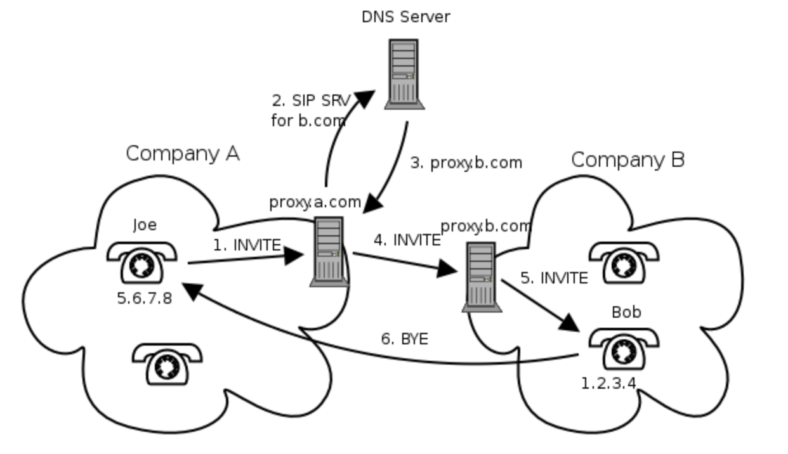

以下内容参照Kamailio的[背景知识](https://www.kamailio.org/docs/tutorials/sip-introduction/)，进行学习和总结。

- [SIP协议产生的意义](#sip协议产生的意义)
- [SIP的URI](#sip的uri)
- [SIP的网络元素](#sip的网络元素)
  - [用户代理](#用户代理)
  - [代理服务](#代理服务)
  - [注册服务](#注册服务)
  - [重定向服务](#重定向服务)
- [SIP消息的组成](#sip消息的组成)
  - [SIP请求](#sip请求)
  - [SIP响应](#sip响应)
  - [SIP事务](#sip事务)
  - [SIP会话](#sip会话)
  - [典型的SIP场景](#典型的sip场景)



## SIP协议产生的意义

它代表会话发起协议（Session Initiation Protocol），基于HTTP协议。

## SIP的URI

URI（Uniform Resource Identifier）是什么样的：`sip:username@domain`, 例如, sip:joe@company.com。

## SIP的网络元素

包括用户代理、代理服务、注册服务和重定向服务，这通常都是逻辑上的概念。

### 用户代理

分为用户客户端代理（UAC）和用户服务端代理 (UAS)，很好理解，一通对话肯定有一个发起呼叫方、一个电话被叫方

### 代理服务

就是电话不是直接呼通，而是抵达一个或多个代理服务，代理服务可以记录双方的地址、会话认证、账户认证以及其他很重要的功能，大大提升了对话的安全性和功能性，比如呼叫转移、会话路由等等。这层代理也可以是有状态和无状态的

- 无状态：就是单纯的转移下报文，可简单用于负载均衡、路由，但是无法保持上下文事务
- 有状态：会比较复杂，会创建一个状态，并保持直到事务结束，可以用于记账、NAT辅助、呼叫转移等，性能也就比不上无状态

### 注册服务

不同于IP电话，如果存在软电话、设备终端，需要将其账户信息、IP地址上报登记，当其他的电话直接呼他的名字，就可以从登记表找到他所对应的IP，进行准确的通话了。注册的数据可以存储于文件、MySQL、postgreSQL等

### 重定向服务

呼叫方从该服务换取真正呼叫对象的地址，然后进行呼叫

## SIP消息的组成

### SIP请求

INVITE,ACK，BYE,CANCEL,REGISTER

以下是抓包的一个INVITE:

```log
                                                                                          │INVITE sip:MzMwMTE3MzE1MDg3Mjcy@AAA.BB.CC.DDD:5060 SIP/2.0
            AAA.BB.CC.D:64523             AAA.BB.CC.DDD:5060           xx.xxx.xxx.xxx:5060│Via: SIP/2.0/UDP AAA.BB.CC.D:64523;rport;branch=z9hG4bKPje723762413114994b39d4b7f0bde707c
          ──────────┬─────────          ──────────┬─────────          ──────────┬─────────│Max-Forwards: 70
▒ 18:43:38.624415   │        INVITE (SDP)         │                             │         │From: <sip:AAA.BB.CC.D>;tag=c379bde9e2324cac8d34807d1b233a55
▒       +0.001792   │ ──────────────────────────> │                             │         │To: <sip:xxx@AAA.BB.CC.DDD>
▒ 18:43:38.626207   │  100 trying -- your call is │                             │         │Contact: <sip:AAA.BB.CC.D:64523;ob>
▒       +0.000431   │ <────────────────────────── │                             │         │Call-ID: 6840a9ee98d04d768589185a4f417fbc
▒ 18:43:38.626638   │                             │        INVITE (SDP)         │         │CSeq: 24220 INVITE
▒       +0.012387   │                             │ ──────────────────────────> │         │Allow: PRACK, INVITE, ACK, BYE, CANCEL, UPDATE, INFO, SUBSCRIBE, NOTIFY, REFER, MESSAGE, OPTIONS
▒ 18:43:38.639025   │                             │         100 Trying          │         │Supported: replaces, 100rel, timer, norefersub
▒      +10.397551   │                             │ <────────────────────────── │         │Session-Expires: 1800
▒ 18:43:49.036576   │                             │  183 Session Progress (SDP) │         │Min-SE: 90
▒       +0.000679   │                             │ <────────────────────────── │         │User-Agent: MicroSIP/3.21.4
▒ 18:43:49.037255   │  183 Session Progress (SDP) │                             │         │Content-Type: application/sdp
▒       +1.979254   │ <────────────────────────── │                             │         │Content-Length:   342
▒ 18:43:51.016509   │                             │  183 Session Progress (SDP) │         │
▒       +0.000633   │                             │ <<<──────────────────────── │         │v=0
▒ 18:43:51.017142   │  183 Session Progress (SDP) │                             │         │o=- 3928502618 3928502618 IN IP4 AAA.BB.CC.D
▒       +5.220216   │ <<<──────────────────────── │                             │         │s=pjmedia
▒ 18:43:56.237358   │                             │        200 OK (SDP)         │         │b=AS:84
▒       +0.000545   │                             │ <────────────────────────── │         │t=0 0
▒ 18:43:56.237903   │        200 OK (SDP)         │                             │         │a=X-nat:0
▒       +0.011746   │ <────────────────────────── │                             │         │m=audio 4198 RTP/AVP 8 0 101
▒ 18:43:56.249649   │             ACK             │                             │         │c=IN IP4 AAA.BB.CC.D
▒       +0.000559   │ ──────────────────────────> │                             │         │b=TIAS:64000
▒ 18:43:56.250208   │                             │             ACK             │         │a=rtcp:4199 IN IP4 AAA.BB.CC.D
▒      +16.645535   │                             │ ──────────────────────────> │         │a=sendrecv
▒ 18:44:12.895743   │                             │             BYE             │         │a=rtpmap:8 PCMA/8000
▒       +0.000544   │                             │ <────────────────────────── │         │a=rtpmap:0 PCMU/8000
▒ 18:44:12.896287   │             BYE             │                             │         │a=rtpmap:101 telephone-event/8000
▒       +0.000265   │ <────────────────────────── │                             │         │a=fmtp:101 0-16
│ 18:44:12.896552   │           200 OK            │                             │         │a=ssrc:802186640 cname:5bbf1ed74f852ccc
│       +0.000323   │ ──────────────────────────> │                             │         │
│ 18:44:12.896875   │                             │           200 OK            │         │
│       +1.997741   │                             │ ──────────────────────────> │         │
│ 18:44:14.894616   │                             │             BYE             │         │
│       +0.000178   │                             │ <<<──────────────────────── │         │
│ 18:44:14.894794   │                             │           200 OK            │         │
│       +3.999680   │                             │ ────────────────────────>>> │         │
│ 18:44:18.894474   │                             │             BYE             │         │
│       +0.000515   │                             │ <<<──────────────────────── │         │
│ 18:44:18.894989   │             BYE             │                             │         │
│       +0.000283   │ <<<──────────────────────── │                             │         │
│ 18:44:18.895272   │           200 OK            │                             │         │
│       +0.000410   │ ────────────────────────>>> │                             │         │
│ 18:44:18.895682   │                             │           200 OK            │         │
│       +3.998668   │                             │ ────────────────────────>>> │         │
│ 18:44:22.894350   │                             │             BYE             │         │

```

### SIP响应

100 到 699 的code来指代不同的情况，我们通常可以根据这些来自定义，1xx 是临时答复，2xx 是肯定的最终回复，3xx 用于重定向呼叫者，4xx 是否定的最终响应，5xx 表示问题出在服务器端，6xx 回复代码表示请求无法在任何服务器上完成

例如：

- 100 Trying
- 183 Session Progress (SDP)
- 200 OK (SDP)
- 407
- 487

### SIP事务

对于发出的指令，要求有一个回执，如果未收到将持续监听和持续发起触发回执，比如BYE+OK是一组，一方发送了BYE，另一方必须回执OK，才算这个事务结束，否则BYE将重试

```log
│ 18:44:18.894989   │             BYE             │                            
│       +0.000283   │ <<<──────────────────────── │                           
│ 18:44:18.895272   │           200 OK            │                            
│       +0.000410   │ ────────────────────────>>> │    
```

### SIP会话

这也比较容易理解，会话就是 A和B 的一次对话，要有完成的拨号、呼通、挂断、回执，多组事务组成一个会话

### 典型的SIP场景

- 注册
- 会话邀请
- 会话终止
- Record Routing：默认情况下，在对话框中发送的所有请求都直接从一个用户代理发送到另一个用户代理。只有对话外部的请求才能遍历 SIP 代理。这种方法使 SIP 网络更具可扩展性，因为只有少量 SIP 消息到达代理
- 事件的订阅和通知
- 即时消息