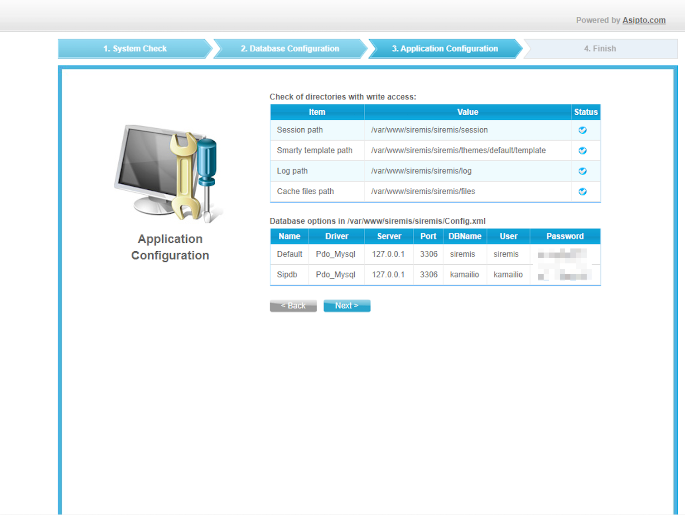
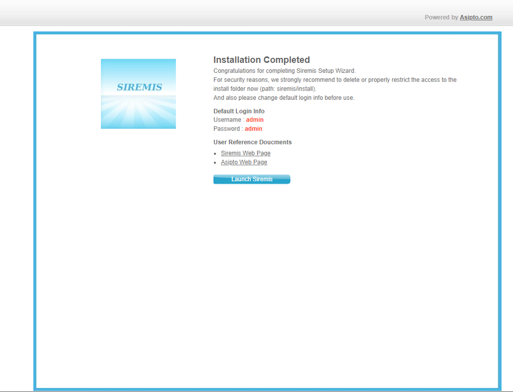
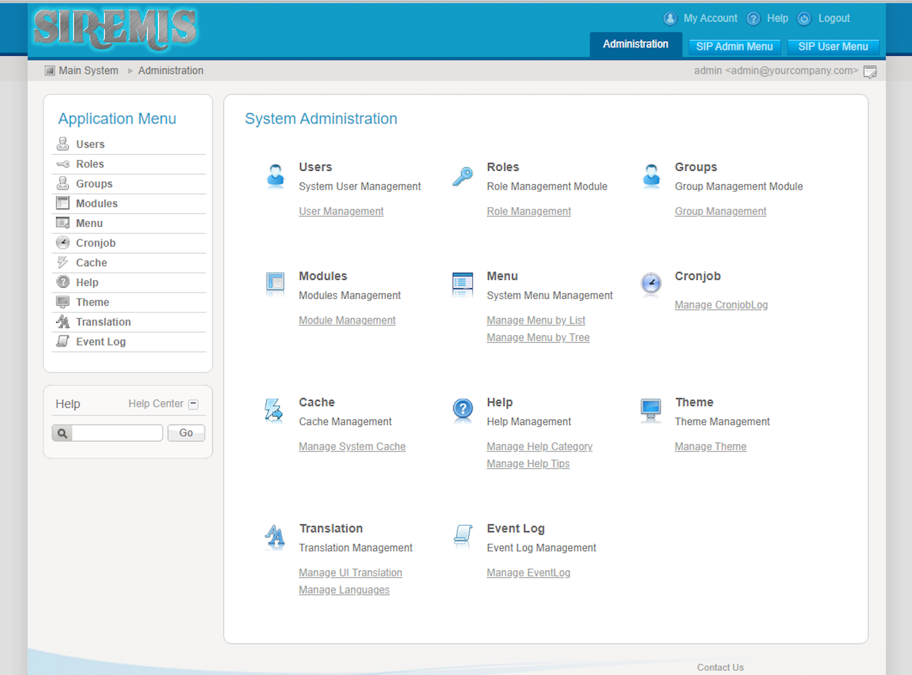

siremis 是针对于 Kamailio 的web管理接口，使用PHP书写，更新至2020年，相对不是太新但是是官方友链的

以下就采用

- Ubuntu 22.04
- Siremis 5.8.0
- apache http server 2.4
- php7.0

如有疑问请参看[官方指南](https://kb.asipto.com/siremis:install53x:main)

## 安装apache2.4 web服务器

```bash
$ sudo apt-get install apache2
[sudo] password for root:
Reading package lists... Done
Building dependency tree... Done
Reading state information... Done
The following package was automatically installed and is no longer required:
  musl
Use 'sudo apt autoremove' to remove it.
The following additional packages will be installed:
  apache2-bin apache2-data apache2-utils libapr1 libaprutil1 libaprutil1-dbd-sqlite3
  libaprutil1-ldap liblua5.3-0 mailcap mime-support ssl-cert

$ sudo a2enmod rewrite
Enabling module rewrite.
To activate the new configuration, you need to run:
  systemctl restart apache2
claire@DESKTOP-UVFKUI7:/usr/local/etc/kamailio$ sudo systemctl restart apache2
claire@DESKTOP-UVFKUI7:/usr/local/etc/kamailio$ sudo apt-get install php libapache2-mod-php php-{mysql,gd,curl,xml,pear}
Reading package lists... Done
Building dependency tree... Done
Reading state information... Done
The following package was automatically installed and is no longer required:
  musl
Use 'sudo apt autoremove' to remove it.
The following additional packages will be installed:
  libapache2-mod-php8.1 libxslt1.1 php-common php8.1 php8.1-cli php8.1-common php8.1-curl php8.1-gd
  php8.1-mysql php8.1-opcache php8.1-readline php8.1-xml
The following NEW packages will be installed:
  libapache2-mod-php libapache2-mod-php8.1 libxslt1.1 php php-common php-curl php-gd php-mysql
  php-pear php-xml php8.1 php8.1-cli php8.1-common php8.1-curl php8.1-gd php8.1-mysql php8.1-opcache
  php8.1-readline php8.1-xml
0 upgraded, 19 newly installed, 0 to remove and 14 not upgraded.
Need to get 5921 kB of archives.
After this operation, 25.3 MB of additional disk space will be used.
Do you want to continue? [Y/n] y
```

可以通过 `systemctl status apache2` 校验是否已具备http服务器，顺便可以确认下服务是否正常，running or failed？ failed的话需要解决一下，保证服务能正常启动
可以通过 `/usr/sbin/apache2 -v` 确认自己http服务器的版本是2.2/2.4/其他

> /etc/apache2/                      # 存放Apache所有文件
> /etc/apache2/apache2.conf          # Apache主要配置文件
> /etc/apache2/sites-available       # Apache虚拟主机配置文件
> /etc/apache2/sites-enabled         # Apache激活的虚拟主机文件，可通过下面命令将sites-available中配置的文件链接到该文件夹中使其生效
> /etc/apache2/sites-enabled/000-default.conf      # 默认激活的网站相关配置文件

## 安装php7.0

php5和php7都是可以的，可以根据自己的情况，我这边选用php7.0

```bash
$ sudo apt-get install php7.0 php7.0-mysql php7.0-gd php7.0-curl php7.0-xml libapache2-mod-php7.0 php-pear
...
Processing triggers for php7.0-fpm (7.0.33-75+ubuntu22.04.1+deb.sury.org+1) ...
NOTICE: Not enabling PHP 7.0 FPM by default.
NOTICE: To enable PHP 7.0 FPM in Apache2 do:
NOTICE: a2enmod proxy_fcgi setenvif
NOTICE: a2enconf php7.0-fpm
NOTICE: You are seeing this message because you have apache2 package installed.
Processing triggers for libapache2-mod-php7.0 (7.0.33-75+ubuntu22.04.1+deb.sury.org+1) ...
Processing triggers for php7.0-cli (7.0.33-75+ubuntu22.04.1+deb.sury.org+1) ...
$:/etc/apache2/mods-enabled$ sudo a2enmod proxy_fcgi setenvif
Considering dependency proxy for proxy_fcgi:
Module proxy already enabled
Module proxy_fcgi already enabled
Module setenvif already enabled
$:/etc/apache2/mods-enabled$ sudo a2enconf php7.0-fpm
Enabling conf php7.0-fpm.
Could not create /etc/apache2/conf-enabled/php7.0-fpm.conf: Permission denied
claire@DESKTOP-UVFKUI7:/etc/apache2/mods-enabled$ sudo a2enmod proxy_fcgi setenvif
Considering dependency proxy for proxy_fcgi:
Module proxy already enabled
Module proxy_fcgi already enabled
Module setenvif already enabled
claire@DESKTOP-UVFKUI7:/etc/apache2/mods-enabled$ sudo  a2enconf php7.0-fpm
Enabling conf php7.0-fpm.
To activate the new configuration, you need to run:
  systemctl reload apache2
$ sudo a2enmod php7.0
...
$ sudo pear install XML_RPC2
WARNING: channel "pear.php.net" has updated its protocols, use "pear channel-update pear.php.net" to update
downloading XML_RPC2-1.1.5.tgz ...
Starting to download XML_RPC2-1.1.5.tgz (68,449 bytes)
...
```

## 下载源码并安装

```bash
$ cd /var/www #web服务器的网页目录
$:/var/www$ sudo git clone https://github.com/asipto/siremis
[sudo] password for claire:
Cloning into 'siremis'...
remote: Enumerating objects: 9155, done.
remote: Counting objects: 100% (208/208), done.
remote: Compressing objects: 100% (104/104), done.
remote: Total 9155 (delta 106), reused 187 (delta 99), pack-reused 8947
Receiving objects: 100% (9155/9155), 12.73 MiB | 168.00 KiB/s, done.
Resolving deltas: 100% (5282/5282), done.
$:/var/www$ cd siremis/

```

## 配置Siremis访问路径

我这边是Apache v2.4的服务，具体可以通过 `/usr/sbin/apache2 -v` 来确认自己的版本

```bash
$:/var/www/siremis$ ls -l
total 32
-rw-r--r--  1 root root 11848 Jun 18 13:22 ChangeLog
-rw-r--r--  1 root root  3931 Jun 18 13:22 Makefile
-rw-r--r--  1 root root  2069 Jun 18 13:22 README.md
drwxr-xr-x  5 root root  4096 Jun 18 13:22 misc
drwxr-xr-x  7 root root  4096 Jun 18 13:22 openbiz
drwxr-xr-x 14 root root  4096 Jun 18 13:22 siremis
$:/var/www/siremis$ sudo make apache24-conf
# siremis apache 2.4 conf snippet ...

        Alias /siremis "/var/www/siremis/siremis"
        <Directory "/var/www/siremis/siremis">
                Options Indexes FollowSymLinks MultiViews
                AllowOverride All
                Require all granted
                <FilesMatch "\.xml$">
                        Require all denied
                </FilesMatch>
                <FilesMatch "\.inc$">
                        Require all denied
                </FilesMatch>
        </Directory>
```

修改对应页面的配置

```bash
$: cd /etc/apache2/sites-available  
$: ls -l
000-default.conf
default-ssl.conf
$: sudo vim 000-default.conf #加入 make apache24-conf 获取的返回内容，配置访问页，这个规则可以根据实际情况自行调整
```

## 初始化Siremis的配置文件

```bash
$ :/var/www/siremis$ sudo make prepare24 #我这边是apache2.4
updating htaccess file for apache 2.4 ...
deploying htaccess files for apache 2.4 in subdirs ...
updating app.inc file...
creating folders...
done

$:/var/www/siremis$ sudo make chown #修改文件的归属用户，确保用户权限
changing onwner to www-data:www-data ...
chown -R www-data:www-data .
```

## 使用MySQL作为存储

由于前期我们部署 Kamailio 也使用了MySQL数据库，因此这边的Siremis也配置上。

root用户登录数据库 > 创建 siremis 数据库 > 给用户授权

```sql
mysql> create database siremis;
Query OK, 1 row affected (0.02 sec)

mysql> create user 'siremis'@'%' IDENTIFIED BY 'siremisrw';
Query OK, 0 rows affected (0.04 sec)

mysql>  GRANT ALL PRIVILEGES ON siremis.* TO siremis@'%';
Query OK, 0 rows affected (0.01 sec)

mysql> flush privileges;
Query OK, 0 rows affected (0.01 sec)

mysql> exit

```

## 启动并验证

重启或者reload apache2服务

因为前面我们修改了一些配置，所以重启一下服务 `systemctl restart apache2`, 通过 `systemctl status apache2` 确认服务是否running

访问 `localhost/siremis`，因为我这边是默认配置80/siremis路径，具体可以根据自己的情况调整，即可访问到。

首先是一个数据库连接配置+数据库数据初始化的环节。 参照官方的指印可以很快速的完成。

### System Check

配置正确、权限正确的话，整页都是打勾的，直接下一步

### Database Configuration

这个版面就是配置 kamailio 库的连接方式和 siremis 库的连接方式。我们前面都有设置和配置权限，直接把host/port/username/password 填上

**最重要的是注意下面的四个勾选项**

- Create Siremis DB: 不勾选，我们已经手动创建了
- Import Default Data: 勾选
- Update SIP DB: 勾选，可能是更新kamailio相关把，不清楚
- Replace DB Config: 勾选

填写和勾选完之后，点击Next，这个步骤很关键，如果顺利是一两秒就下一页了，如果你转了很长时间可能就存在问题哦。比如我初次部署有遇到数据库连接问题以及未知的错误导致一直reloading，这个日志也很难查看，不容易定位。

### Application Configuration

这个就是校验配置项，如果前面都顺利，这里是没有问题的，都是通过




### Finish

告知你一个管理员初始的账号密码



点击Launch Siremis

### 登录平台

登录并查看平台功能



有点复古，不过看你使用Kamailio的什么功能，常规的注册、负载均衡、通话的查看配置也都有，报表相对不算丰富。

看过kamailio数据库表或者使用过命令行的同学看了就能知道，这些其实就是与指令相对应，查询和操作对应的表，这个即使一个可视化工具，不要有太大的期望。