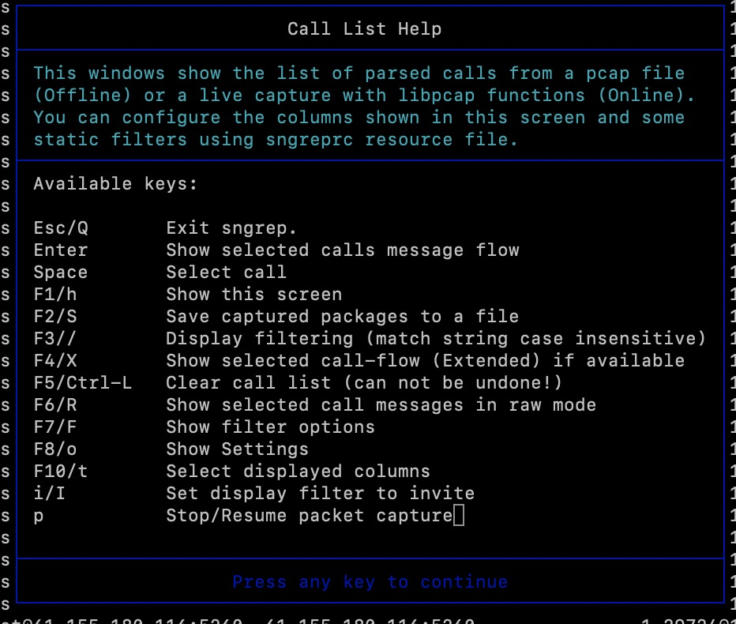
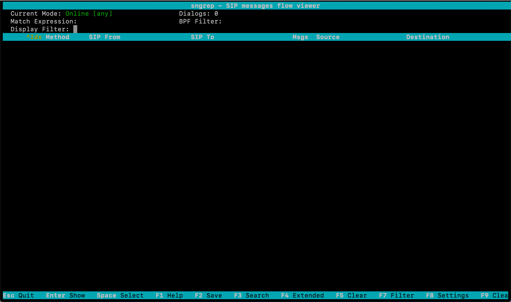
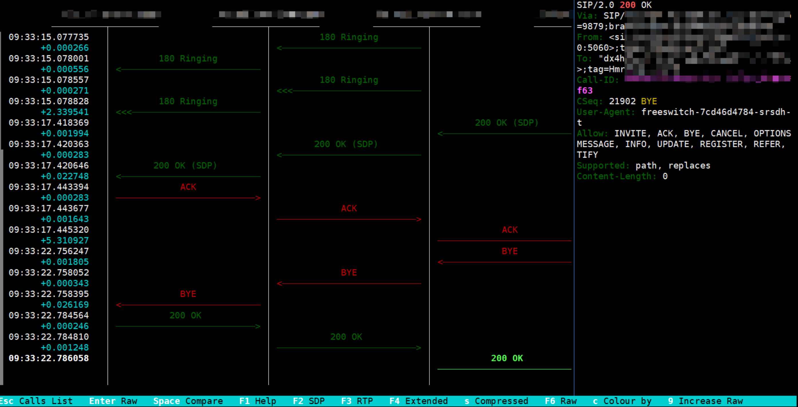
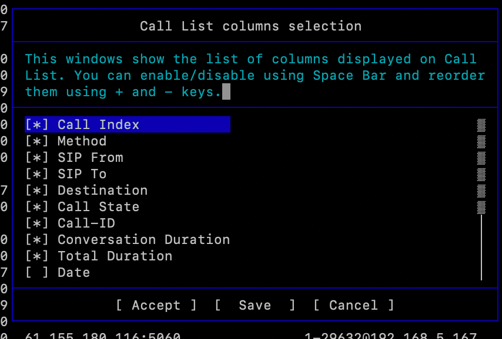
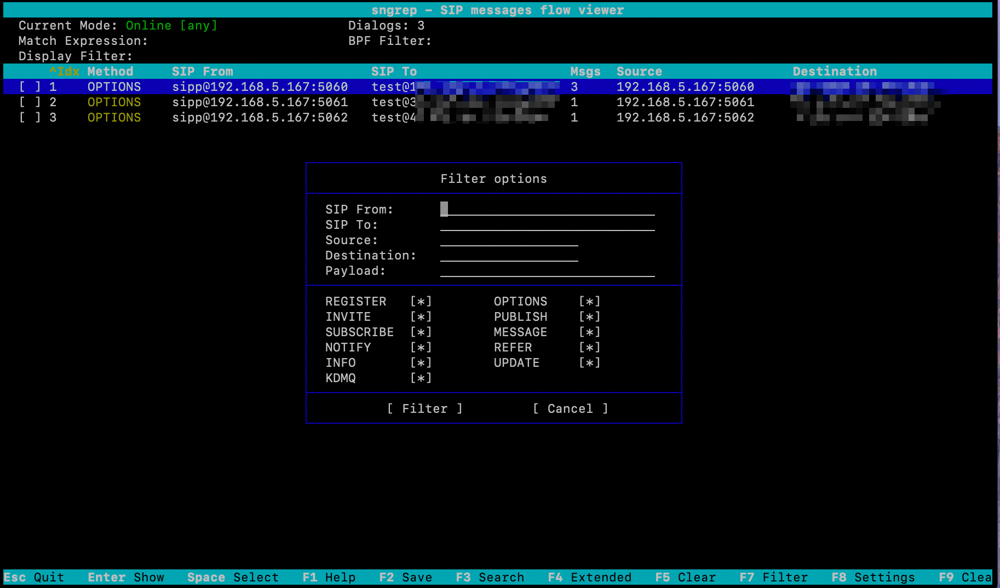
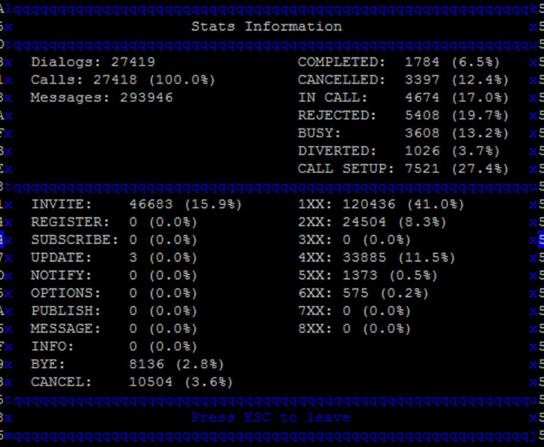

一个sip的抓包小工具，在GitHub上竟然能够积累1K的star，看来还是有点东西，当然官方的友链也是发挥了重要作用

首先[送上项目地址](https://github.com/irontec/sngrep)，有能力的宝子可以自行查看

经典的网络抓包工具有很多，比如：

- Wireshark： 大而全
- tcpdump： 较底层
- Fiddler：主要用于HTTP/HTTPS协议
- ……

但是对于本章要讲的SIP信令的抓包，也就是Wireshark、tcpdump，以及前面讲到过较为系统的Homer，如果嫌弃Wireshark笨重、tcpdump原始，那么就一起来看看这款短小精悍的sngrep。

官方自己定义：是一款可以在命令行终端展示SIP电话消息流的工具，它能够支持实时的抓取并展现SIP包，也可以用来做一个pcap的阅读器。

面向命令行终端，具有可视化能力，实时抓取并展示，简直是生产调试与运维的利器。

- [如何安装？](#如何安装)
- [如何使用？](#如何使用)
  - [如何抓取](#如何抓取)
    - [一些样例](#一些样例)
  - [如何查看pcap文件](#如何查看pcap文件)
  - [如何查看在线统计](#如何查看在线统计)

## 如何安装？

前提条件，需要服务器上具备这些模块：

- libncurses5 - for UI, windows, panels.
- libpcap - for capturing packets.
- libssl - (optional) for TLS transport decrypt using OpenSSL and libcrypt
- gnutls - (optional) for TLS transport decrypt using GnuTLS and libgcrypt
- libncursesw5 - (optional) for UI, windows, panels (wide-character support)
- libpcre - (optional) for Perl Compatible regular expressions
- zlib - (optional) for gzip compressed pcap files

可以使用autotools构建，或者cmake，基本是类似的，我这边就用的常规centos系统

autotools:

```bash
./bootstrap.sh
./configure
make
make install (as root)
```

cmake:

```bash
mkdir build && cd build
cmake [<options>] ..
make
make install (as root)
```

一切顺利，构建成功

想要自定义配置项？

- /etc/sngreprc 系统范围的配置文件。使用此文件可以覆盖某些 sngrep 选项。
- ~/.sngreprc 用户的配置文件。如果存在此文件，则 options 将覆盖系统范围的配置。

## 如何使用？

sngrep 由于是网络抓包，因此至少需要sudo权限。

对于参数可以通过man/help来看一下

```bash
# sngrep --help
Usage: sngrep [-hVcivNqrD] [-IO pcap_dump] [-d dev] [-l limit] [-B buffer] [<match expression>] [<bpf filter>]

-h     Display help and usage information.
-V     Display version information.
-c     Only capture dialogs starting with an INVITE request.
-r     Store RTP packets payload in memory (enables saving RTP to pcap)
-i     Make match expression case insensitive.
-v     Invert match expression.
-I pcap_dump
              Read packets from pcap file instead of network devices. This option can be used with bpf filters.
-O pcap_dump
              Save all captured packets to a pcap file. This option can be used with bpf filters. When receiving a SIGUSR1 signal sngrep will reopen the pcap file in order to  facilitate  pcap  file
              rotation.
-B buffer
              Change size of pcap capture buffer (default: 2MB)
-d dev Use  this  capture device instead of default (any). Special keyword 'any', a device name like 'eth0' or a comma separated list like 'eth1,eth3'. This overrides the settings in the con‐
              figuration file.
-k keyfile
              Use private keyfile to decrypt TLS packets.
-l limit
              Change default capture limit (20000 dialogs) Limit must be a numeric value above 1 and can not be disabled. This is both security measure to avoid unlimited memory usage and also  used
              internally in sngrep to manage hash table sizes.
-R     Remove oldest dialog when the capture limit has reached Although not recommended, this can be used to keep sngrep running during long times with some control over consumed memory.
-N     Don't display sngrep interface, just capture
-q     Don't print captured dialogs in no interface mode
-H     Send captured packets to a HEP server (like Homer or another sngrep) Argument must be an IP address and port in the format: udp:A.B.C.D:PORT
-L     Start a HEP server listening for packets Argument must be an IP address and port in the format: udp:A.B.C.D:PORT
-E     Enable parsing of captured HEP3 packets.
match expression
              Match given expression in Messages' payload. If one request message matches the given expression, the following messages within the same dialog will be also captured.
bpf filter
              Selects a filter that specifies what packets will be parsed.  If no bpf filter is given, all SIP packets seen on the selected interface or pcap file will be displayed.  Otherwise, only
              packets for which bpf filter is `true' will be displayed.
```

可以通过命令行指定后开启抓包，也可以开启后在内部过滤

- `-d` 网口或设备
- `-I` 主要是用于查看指定的pcap文件，以便查看sip对话的可视化图
- `-O` 主要是将实时抓包的数据输出到文件
- `-r` 主要是抓RTP， 指的是实时传输协议（Real-time Transport Protocol, RTP）数据包的有效载荷部分。RTP 是一个用于传输音频和视频等多媒体数据的网络协议，常用于流媒体服务、语音通信系统（如VoIP）、视频会议等场景中。
- `-l` 给到数量限制，这个是重要的
- `-T` 将pcap保存到文本文件

以上是比较常规的参数，常规的使用就是根据一些规则去抓取网络数据包，将pcap文件读取后展示。

### 如何抓取

首先看到`sngrep [-hVcivlkNqEr] [ -IO pcap_dump ] [ -d dev ] [ -l limit ] [ -k keyfile ] [-LH capture_url ] [ <match expression> ] [ <bpf filter> ]` 指令的说明

- [-hVcivlkNqEr] 这一组参数，在help里面已经看的很清楚了
- [ -IO pcap_dump ] 描述输入的来源，输出的目的
- [ -d dev ] 指定设备
- [ -l limit ] 输出的限制，避免卡死
- [ -k keyfile ] 对于tls的包，需要私钥文件解密
- [-LH capture_url ] 开启一个Hep server，或者开始向Hep server发网络包数据，这个结合Homer这章很好理解
- [ <match expression> ] 表达式形式对抓取的网络数据包进行过滤
- [ <bpf filter> ] 对于抓取了的网络数据包是否展示的过滤器

开启抓包后也可以查看工具的一些快捷操作指令



#### 一些样例

`sngrep`, 直接开启抓，不管三七二十一，全抓



**F1** 查看页面帮助

**F2** Save就类似于-O，但是可以在页面筛选、取消某些会话的导出，-O就是全部了

**F3**  Display Filter 页面级别的关键字搜索，一些不在Filter项中的内容，比如callid，可以直接这样定位，比较实用

**F4** 给我感觉就是和Enter是一样的，就是展示对话流

**F5** 全清

**F6** RAW模式，和tcpdump的效果是一样的，就是有进出流量的染色，比较便于观察

**F7** 开启页面过滤：

- 关键词筛选 SIP From/SIP To/Source/Destination/Playload，选项相对不多，可以对于整体数据做出关键词过滤
- 筛选信令类型，空格选中或取消
- Filter 过滤

**Enter** 看流图


**F8** 系统的一些配置项，带*的需要重启生效 

**F10** 选择列进行展示



`sngrep -d eth0 -O save.pcap port 5060 and udp`，指定eth0网口，将数据保存到save.pcap文件，指定端口5060，指定udp类型



其他所有的按键绑定都在这里了：[sngrep/src/keybinding.c](https://github.com/irontec/sngrep/blob/6ee2c9ca551508d620d9bf1d02bcff231da00455/src/keybinding.c#L72)，感兴趣的话就去阅读一下吧

### 如何查看pcap文件

`sngrep -I file.pcap host 192.168.1.1 and port 5060`, 从file.pcap读取抓包数据，过滤host和端口

### 如何查看在线统计

从应用的角度会有一些带有业务逻辑的统计，那么简单从SIP的对话层面上，sngrep也是很热心的做了一版本统计，用于观察当前捕获多少对话、多少通话、多少消息，其中对话的各种状态如何，信令各个状态数量如何，基于经验可以快速分析到整体的情况。



怎么打开它？很简单，如果你也阅读过上面的按键绑定，你就可以知道，列表页面键盘输入 “i” 即可展示。

一个简单易用高效的工具，一定可以帮你解决80%的问题。
