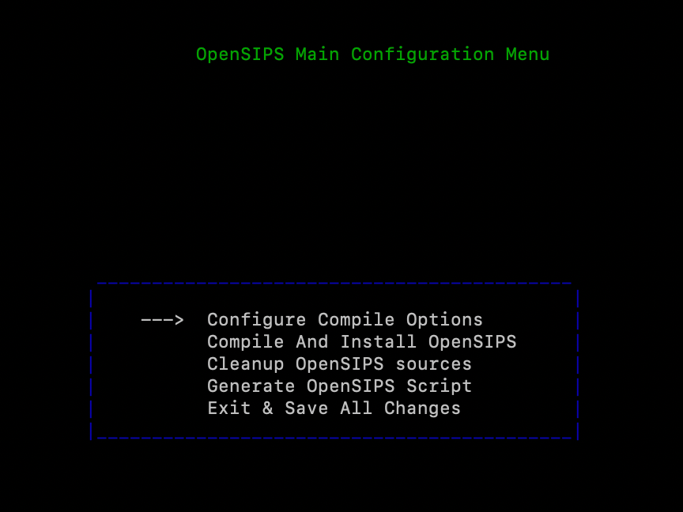
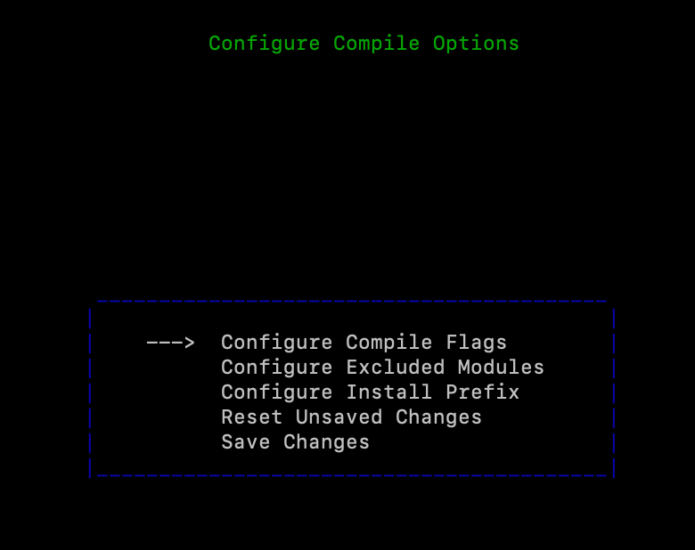

前期讲到了Kamailio，它是一个不错的`开源SIP（Session Initiation Protocol）服务器`，主要用于构建高效的VoIP（Voice over IP）平台以及即时通讯服务。但是在同根同源（OpenSER）的分支上，还有一个有力的代表，就是OpenSIPS。它同样十分强大，非常适合于构建定制的VoIP解决方案。

[官网地址](https://opensips.org/)介绍它是，一个多功能、多用途的信令 SIP 服务器，可供运营商、电信公司或 ITSP 用于`Class4/5 住宅平台、中继/批发、企业/虚拟 PBX 解决方案、会话边界控制器、应用服务器、前端负载均衡器、IMS 平台、呼叫中心`等解决方案。

它的优点有：

- 高吞吐量-`数万CPS`
- 路由和集成的灵活性-用于实现自定义路由逻辑的路由脚本，多个接口 API
- 有效的应用程序构建-超过 120 个模块提供功能，用于 SIP 处理、后端操作、集成、路由逻辑

截止目前发版情况：

- `3.5.3 - 稳定版本`
- `3.4.10 - 稳定 LTS 版本`

对于[关于版本](https://opensips.org/About/About)也是介绍了OpenSIPS是什么、为什么、特点是什么，感兴趣可以自行前往官方地址阅读，这边就不详细描述了。

下面我们就从部署一个简单的OpenSIPS开始，了解这个组件。

OpenSIPS相对而言，就比较逻辑清晰的文档体系，从关于版本就可以快速找到 [Getting Started 的链接地址](https://www.opensips.org/Documentation/Tutorials-GettingStarted)，使得学习和了解的流程十分顺畅。

- [选择一个版本，然后下载它](#选择一个版本然后下载它)
- [解压并编译](#解压并编译)
- [坐享其成，启动它](#坐享其成启动它)


## 选择一个版本，然后下载它

OpenSIPS所有的介绍板块，都在顶部的Documention中。

点击进来，首先是选择你需查看的版本，由于OpenSIPS的版本迭代较为密集，并且它势如破竹，短期内就吸引了大量开源模块的引入和调整，因此版本间差异还是有的，比如参数、方法名等等，因此选择版本是必要的。

我们建议尝鲜就是使用最新开发版本，生产就是使用稳定版本或稳定LTS(Long Term Support)版本。

点击最新版OpenSIPS 3.5 Manual (index)，进来后文档目录非常清晰地展示了内容，包括：安装、配置、脚本编程、接口、测试，我们目前要关注的就是安装和配置板块。

我们可以选择编译好的包进行安装，或者源码安装，这里选择编译包。下载的链接有很多，可以根据自己的网络情况选择下载，最终就是一个`opensips-3.5.3.tar.gz`。

## 解压并编译

解压到当前目录：

```bash
tar -zxvf opensips-3.5.3.tar.gz
```

解压完成后，进入目录你就可以看到这样一些配置文件，就是后续会进行配置的文件，不过这个配置可以交给OpenSIPS自己做：

```bash
 Makefile
-rw-r--r--   1 root root    11568 1月  21 15:18 Makefile.conf
-rw-rw-r--   1 1000 1000    11664 10月 23 23:15 Makefile.conf.template
-rw-rw-r--   1 1000 1000    46376 10月 23 23:15 Makefile.defs
-rw-rw-r--   1 1000 1000      470 10月 23 23:15 Makefile.misclibs
-rw-rw-r--   1 1000 1000     1675 10月 23 23:15 Makefile.modules
-rw-rw-r--   1 1000 1000     1060 10月 23 23:15 Makefile.openssl
-rw-rw-r--   1 1000 1000     5643 10月 23 23:15 Makefile.rules
-rw-rw-r--   1 1000 1000      706 10月 23 23:15 Makefile.sources
-rw-rw-r--   1 1000 1000     1000 10月 23 23:15 Makefile.test
```

OpenSIPS提供了一个非常便捷、人性化的可视化界面，供部署人员去选择和编译，而不需要手动修改Makefile文件，也不需要再呼冲突优先级什么的问题。

接下来这个指令很重要：`make menuconfig`

这个指令就会启动配置面板

```bash
[@ opensips-3.5.3]# make menuconfig
Generating parser
Generating lexer
```



可以看到几个选项：

- Configure Compile Options 配置编译选项，主要是配置可选的编译模块，编译脚本的地址
- Compile And Install OpenSIPS 开始编译安装OpenSIPS
- Cleanup OpenSIPS sources 清理源文件
- Generate OpenSIPS Script 初始化脚本
- Exit & Save All Changes  退出并保存

我们第一步就是选择第一项，并Enter



进来之后，你又能看到一组选项：

- Configure Compile Flags 配置编译flags(这块主要是选择一些内存分配方式、debug模式、锁机制、自身监控等)
- Configure Excluded Modules 配置排除的模块，默认排除，选中为不排除
- Configure Install Prefix 配置安装的路径前缀
- Reset Unsaved Changes 取消未保存的修改
- Save Changes  保存修改

作为第一次测试安装，采用默认路径存放OpenSIPS可执行指令，额外的模块不安装，额外的flags不选

所以这个版本选择【Save Changes】，按方向左键返回上一页，再选择【Compile And Install OpenSIPS】，就可以开始编译了。

## 坐享其成，启动它

由于它的便利性、集成性，让初学者可以快速地部署起一个OpenSIPS节点，并快速体验它的特性，这是个非常友好的功能。

经过上面的编译，在短短的时间内，你就可以看到完成界面。

```bash
make[2]: 离开目录“/data/software/opensips-3.4.9/modules/mangler”
make[2]: 进入目录“/data/software/opensips-3.4.9/modules/nathelper”
make[2]: 对“install_module_custom”无需做任何事。
make[2]: 离开目录“/data/software/opensips-3.4.9/modules/nathelper”
make[2]: 进入目录“/data/software/opensips-3.4.9/modules/jsonrpc”
make[2]: 对“install_module_custom”无需做任何事。
make[2]: 离开目录“/data/software/opensips-3.4.9/modules/jsonrpc”
make[2]: 进入目录“/data/software/opensips-3.4.9/modules/mediaproxy”
make[2]: 对“install_module_custom”无需做任何事。
make[2]: 离开目录“/data/software/opensips-3.4.9/modules/mediaproxy”
make[2]: 进入目录“/data/software/opensips-3.4.9/modules/b2b_entities”
make[2]: 对“install_module_custom”无需做任何事。
make[2]: 离开目录“/data/software/opensips-3.4.9/modules/b2b_entities”
make[1]: 离开目录“/data/software/opensips-3.4.9”


Press any key to return to menuconfig

```

看到这个描述后，就可以 Enter  -> Exit & Save All Changes.

看看指令在哪儿，确认下版本

```bash
[@ opensips-3.5.3]# whereis opensips
opensips: /usr/sbin/opensips /usr/lib64/opensips /etc/opensips /usr/local/sbin/opensips /usr/local/etc/opensips /usr/share/opensips /usr/share/man/man8/opensips.8.gz


[@ opensips-3.5.3]# opensips -V
version: opensips 3.5.3 (x86_64/linux)
flags: STATS: On, DISABLE_NAGLE, USE_MCAST, SHM_MMAP, PKG_MALLOC, Q_MALLOC, F_MALLOC, HP_MALLOC, DBG_MALLOC, FAST_LOCK-ADAPTIVE_WAIT
ADAPTIVE_WAIT_LOOPS=1024, MAX_RECV_BUFFER_SIZE 262144, MAX_LISTEN 16, MAX_URI_SIZE 1024, BUF_SIZE 65535
poll method support: poll, epoll, sigio_rt, select.
git revision: cd02af8d9
main.c compiled on 10:13:46 Jan 27 2025 with gcc 4.8.5
```

使用最小版本配置文件，启动一个OpenSIPS服务

使用官方的sample文件，直接测试。

```bash
mv opensips.cfg.sample  opensips.cfg
```


```bash
#
# OpenSIPS residential configuration script
#     by OpenSIPS Solutions <team@opensips-solutions.com>
#
# This script was generated via "make menuconfig", from
#   the "Residential" scenario.
# You can enable / disable more features / functionalities by
#   re-generating the scenario with different options.#
#
# Please refer to the Core CookBook at:
#      https://opensips.org/Resources/DocsCookbooks
# for a explanation of possible statements, functions and parameters.
#


####### Global Parameters #########

/* uncomment the following lines to enable debugging */
#debug_mode=yes

log_level=3
xlog_level=3
stderror_enabled=no
syslog_enabled=yes
syslog_facility=LOG_LOCAL0

udp_workers=4

/* uncomment the next line to enable the auto temporary blacklisting of 
   not available destinations (default disabled) */
#disable_dns_blacklist=no

/* uncomment the next line to enable IPv6 lookup after IPv4 dns 
   lookup failures (default disabled) */
#dns_try_ipv6=yes


socket=udp:127.0.0.1:5060   # CUSTOMIZE ME


####### Modules Section ########

#set module path
mpath="/usr/local//lib64/opensips/modules/"

#### SIGNALING module
loadmodule "signaling.so"

#### StateLess module
loadmodule "sl.so"

#### Transaction Module
loadmodule "tm.so"
modparam("tm", "fr_timeout", 5)
modparam("tm", "fr_inv_timeout", 30)
modparam("tm", "restart_fr_on_each_reply", 0)
modparam("tm", "onreply_avp_mode", 1)

#### Record Route Module
loadmodule "rr.so"
/* do not append from tag to the RR (no need for this script) */
modparam("rr", "append_fromtag", 0)

#### MAX ForWarD module
loadmodule "maxfwd.so"

#### SIP MSG OPerationS module
loadmodule "sipmsgops.so"

#### FIFO Management Interface
loadmodule "mi_fifo.so"
modparam("mi_fifo", "fifo_name", "/run/opensips/opensips_fifo")
modparam("mi_fifo", "fifo_mode", 0666)

#### USeR LOCation module
loadmodule "usrloc.so"
modparam("usrloc", "nat_bflag", "NAT")
modparam("usrloc", "working_mode_preset", "single-instance-no-db")

#### REGISTRAR module
loadmodule "registrar.so"
modparam("registrar", "tcp_persistent_flag", "TCP_PERSISTENT")
/* uncomment the next line not to allow more than 10 contacts per AOR */
#modparam("registrar", "max_contacts", 10)

#### ACCounting module
loadmodule "acc.so"
/* what special events should be accounted ? */
modparam("acc", "early_media", 0)
modparam("acc", "report_cancels", 0)
/* by default we do not adjust the direct of the sequential requests.
   if you enable this parameter, be sure to enable "append_fromtag"
   in "rr" module */
modparam("acc", "detect_direction", 0)

loadmodule "proto_udp.so"

####### Routing Logic ########

# main request routing logic

route{

	if (!mf_process_maxfwd_header(10)) {
		send_reply(483,"Too Many Hops");
		exit;
	}

	if (has_totag()) {

		# handle hop-by-hop ACK (no routing required)
		if ( is_method("ACK") && t_check_trans() ) {
			t_relay();
			exit;
		}

		# sequential request within a dialog should
		# take the path determined by record-routing
		if ( !loose_route() ) {
			# we do record-routing for all our traffic, so we should not
			# receive any sequential requests without Route hdr.
			send_reply(404,"Not here");
			exit;
		}

		if (is_method("BYE")) {
			# do accounting even if the transaction fails
			do_accounting("log","failed");
		}

		# route it out to whatever destination was set by loose_route()
		# in $du (destination URI).
		route(relay);
		exit;
	}

	# CANCEL processing
	if (is_method("CANCEL")) {
		if (t_check_trans())
			t_relay();
		exit;
	}

	# absorb retransmissions, but do not create transaction
	t_check_trans();

	if ( !(is_method("REGISTER")  ) ) {
		
		if (is_myself("$fd")) {
					
		} else {
			# if caller is not local, then called number must be local
			
			if (!is_myself("$rd")) {
				send_reply(403,"Relay Forbidden");
				exit;
			}
		}

	}

	# preloaded route checking
	if (loose_route()) {
		xlog("L_ERR",
			"Attempt to route with preloaded Route's [$fu/$tu/$ru/$ci]");
		if (!is_method("ACK"))
			send_reply(403,"Preload Route denied");
		exit;
	}

	# record routing
	if (!is_method("REGISTER|MESSAGE"))
		record_route();

	# account only INVITEs
	if (is_method("INVITE")) {
		
		do_accounting("log");
	}

	
	if (!is_myself("$rd")) {
		append_hf("P-hint: outbound\r\n"); 
		
		route(relay);
	}

	# requests for my domain
	
	if (is_method("PUBLISH|SUBSCRIBE")) {
		send_reply(503, "Service Unavailable");
		exit;
	}

	if (is_method("REGISTER")) {
		# store the registration and generate a SIP reply
		if (!save("location"))
			xlog("failed to register AoR $tu\n");

		exit;
	}

	if ($rU==NULL) {
		# request with no Username in RURI
		send_reply(484,"Address Incomplete");
		exit;
	}

	# do lookup with method filtering
	if (!lookup("location","method-filtering")) {
		t_reply(404, "Not Found");
		exit;
	}

	# when routing via usrloc, log the missed calls also
	do_accounting("log","missed");
	route(relay);
}


route[relay] {
	# for INVITEs enable some additional helper routes
	if (is_method("INVITE")) {
		t_on_branch("per_branch_ops");
		t_on_reply("handle_nat");
		t_on_failure("missed_call");
	}

	if (!t_relay()) {
		send_reply(500,"Internal Error");
	}
	exit;
}


branch_route[per_branch_ops] {
	xlog("new branch at $ru\n");
}


onreply_route[handle_nat] {
	xlog("incoming reply\n");
}


failure_route[missed_call] {
	if (t_was_cancelled()) {
		exit;
	}

	# uncomment the following lines if you want to block client 
	# redirect based on 3xx replies.
	##if (t_check_status("3[0-9][0-9]")) {
	##t_reply(404,"Not found");
	##	exit;
	##}

	
}
```

执行启动脚本 `opensips -f opensips.cfg `，你就可以获得一个启动的OpenSIPS服务

通过指令验证起启动情况：

```bash
lsof -i:5060

COMMAND    PID USER   FD   TYPE    DEVICE SIZE/OFF NODE NAME
opensips 22006 root   50u  IPv4 150102455      0t0  UDP 192.168.1.102:rfb 
opensips 22007 root   50u  IPv4 150102455      0t0  UDP 192.168.1.102:rfb 
opensips 22008 root   50u  IPv4 150102455      0t0  UDP 192.168.1.102:rfb 
opensips 22009 root   50u  IPv4 150102455      0t0  UDP 192.168.1.102:rfb 
opensips 22010 root   50u  IPv4 150102455      0t0  UDP 192.168.1.102:rfb 
opensips 22011 root   50u  IPv4 150102455      0t0  UDP 192.168.1.102:rfb 
opensips 22012 root   50u  IPv4 150102455      0t0  UDP 192.168.1.102:rfb 
opensips 22013 root   50u  IPv4 150102455      0t0  UDP 192.168.1.102:rfb 
opensips 22014 root   50u  IPv4 150102455      0t0  UDP 192.168.1.102:rfb 
opensips 22015 root   50u  IPv4 150102455      0t0  UDP 192.168.1.102:rfb 
```
