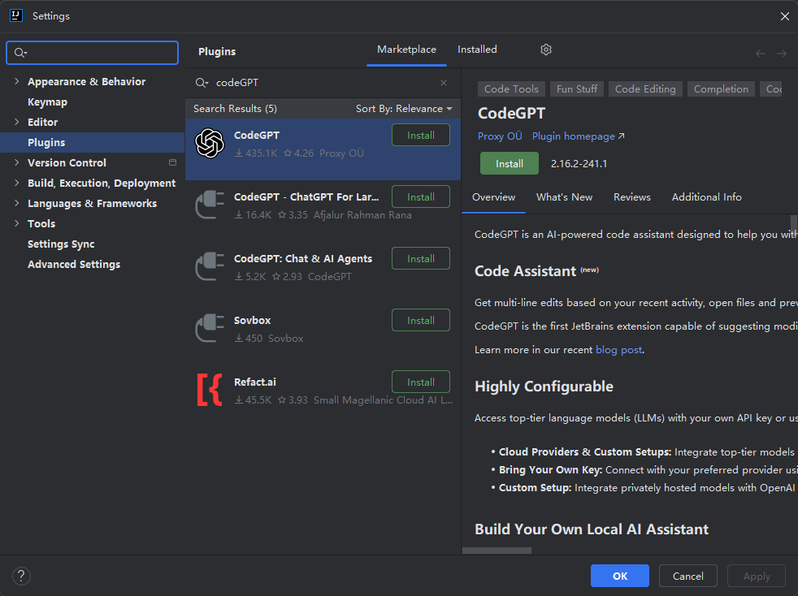
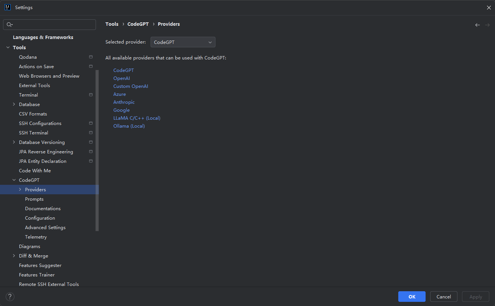
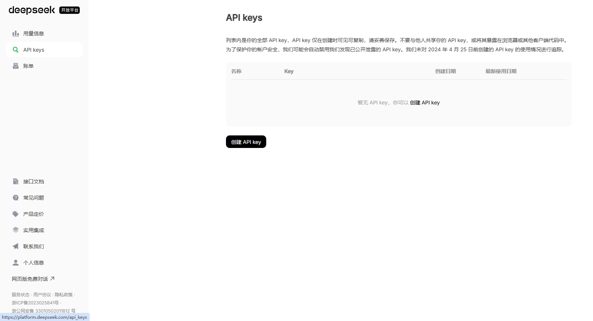
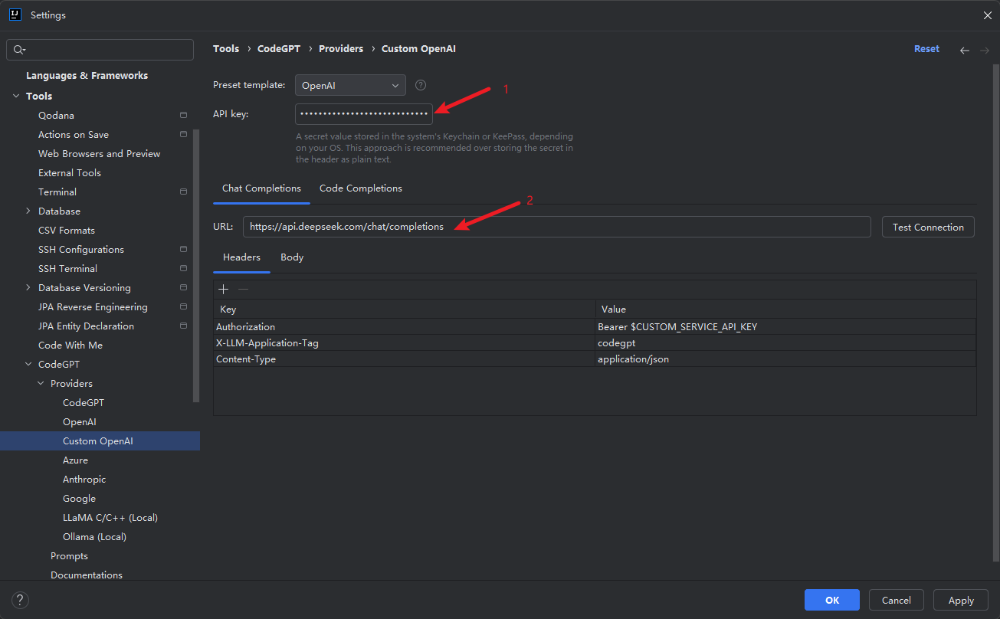
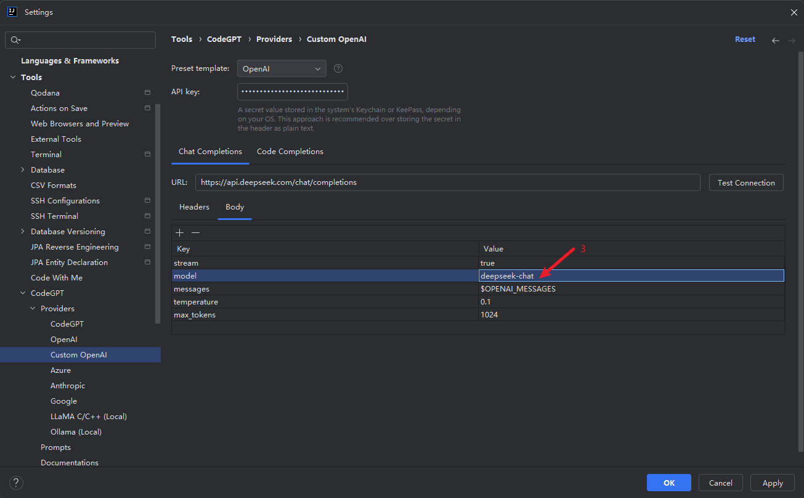
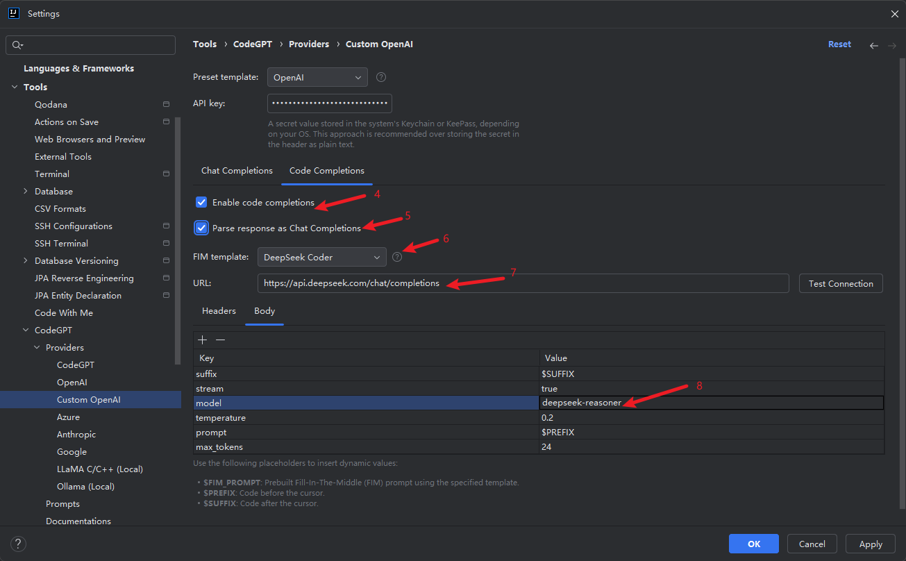
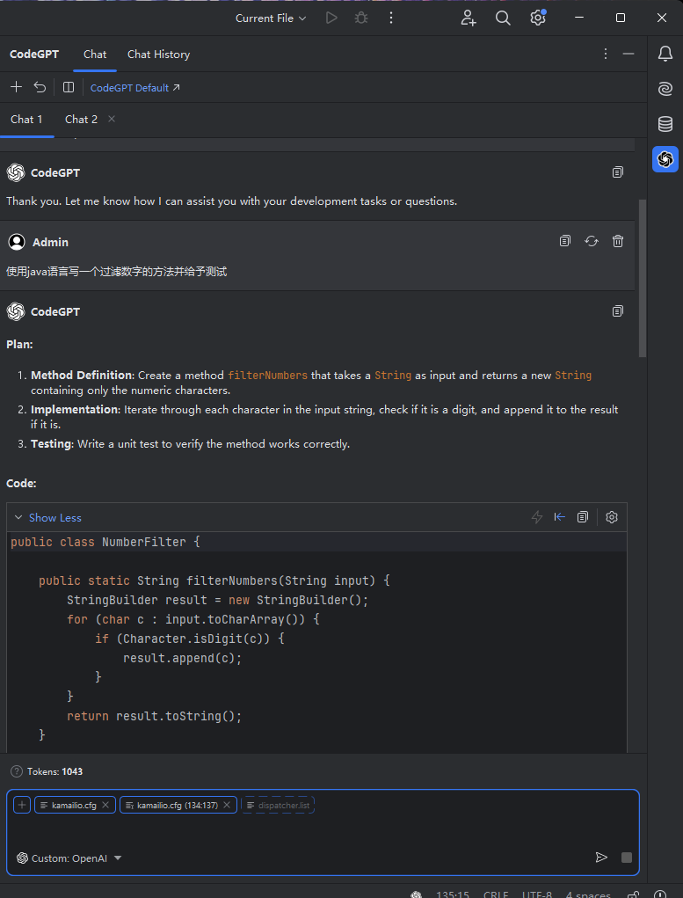
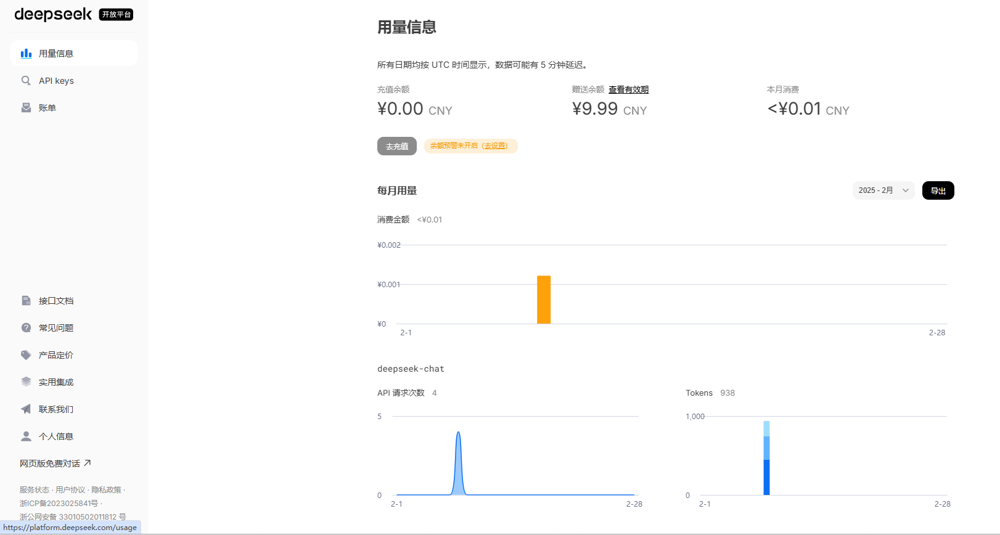

- [1. 准备工作](#1-准备工作)
- [2. 安装 CodeGPT 插件](#2-安装-codegpt-插件)
- [3. 配置 DeepSeek API 密钥](#3-配置-deepseek-api-密钥)
- [4. 测试 DeepSeek 接入](#4-测试-deepseek-接入)
- [5. 使用 DeepSeek 功能](#5-使用-deepseek-功能)
- [6. 查看用量](#6-查看用量)

### 1. 准备工作
   
安装 IntelliJ IDEA：确保已安装 IntelliJ IDEA（社区版或旗舰版均可）。如果能更新，尽量选择新的版本，因为 deepseek 与IDEA的版本有兼容对应关系，IDEA如果偏旧，可能无法体验到新版的配置项。

提前在 deepseek 开放平台注册账号并登录

获取 DeepSeek API 密钥：注册 DeepSeek 账号并获取 API 密钥。

### 2. 安装 CodeGPT 插件

打开 IntelliJ IDEA，进入 File > Settings > Plugins。

在 Marketplace 中搜索 CodeGPT。



点击 Install 安装插件，安装完成后重启 IDEA。

如果因为网络等原因无法进行在线安装，也可以离线下载好后 `Install Plugin from Disk`.



### 3. 配置 DeepSeek API 密钥

通过前置准备，我们已经注册好开放平台的账户，登录后台即可获取 API Key



接下来配置IDEA侧

打开 IntelliJ IDEA，进入 File > Settings > Tools > CodeGPT。

在 API Key 字段中，输入从 DeepSeek 获取的 API 密钥。


选择 DeepSeek 作为默认的 AI 模型（如果有多个选项）。

以下一些参数内容主要参照官方说明：https://api-docs.deepseek.com/zh-cn/

配置请求地址：https://api.deepseek.com/chat/completions



model参数： 通过指定 `model='deepseek-chat'` 即可调用 DeepSeek-V3，通过指定 `model='deepseek-reasoner'`，即可调用 DeepSeek-R1

将AI接入IDEA编辑器肯定不仅仅是为了chat，很重要的是在编码方面，提供补全、提示、注释、测试方法等快捷操作，接下来配置编码方面



点击 Apply 保存配置。

### 4. 测试 DeepSeek 接入

可以直接通过CURL的方式，测试网络和api key是否正常：

```bash
:~$ curl https://api.deepseek.com/chat/completions \
  -H "Content-Type: application/json" \
  -H "Authorization: Bearer sk-********" \
  -d '{
        "model": "deepseek-chat",
        "messages": [
          {"role": "system", "content": "You are a helpful assistant."},
          {"role": "user", "content": "Hello!"}
        ],
        "stream": false
      }'
{"id":"4de6c9b3-af0d-4f87-b710-167aa1884d67","object":"chat.completion","created":1738983305,"model":"deepseek-chat","choices":[{"index":0,"message":{"role":"assistant","content":"Hello! How can I assist you today? 😊"},"logprobs":null,"finish_reason":"stop"}],"usage":{"prompt_tokens":11,"completion_tokens":11,"total_tokens":22,"prompt_tokens_details":{"cached_tokens":0},"prompt_cache_hit_tokens":0,"prompt_cache_miss_tokens":11},"system_fingerprint":"fp_3a5770e1b4"}    
```

响应正常后，就可以在IDEA中进行测试



配置后，即可在右侧菜单栏中看到对应功能，通过对话可以实现API的调用。

此外在 IntelliJ IDEA 中打开一个代码文件。

右键点击代码，选择 CodeGPT 菜单中的 Explain Code 或 Generate Code。观察 DeepSeek 的响应。

### 5. 使用 DeepSeek 功能

- 代码补全：在编写代码时，DeepSeek 会自动提供补全建议。

- 代码解释：右键选择代码，使用 Explain Code 功能获取代码解释。

- 代码生成：通过 Generate Code 功能生成代码片段。

- 代码优化：使用 Optimize Code 功能优化现有代码。

### 6. 查看用量

在请求回复后可以在左下角看到Tokens的计数，此外后开放平台后台也可以看到自己的用量

