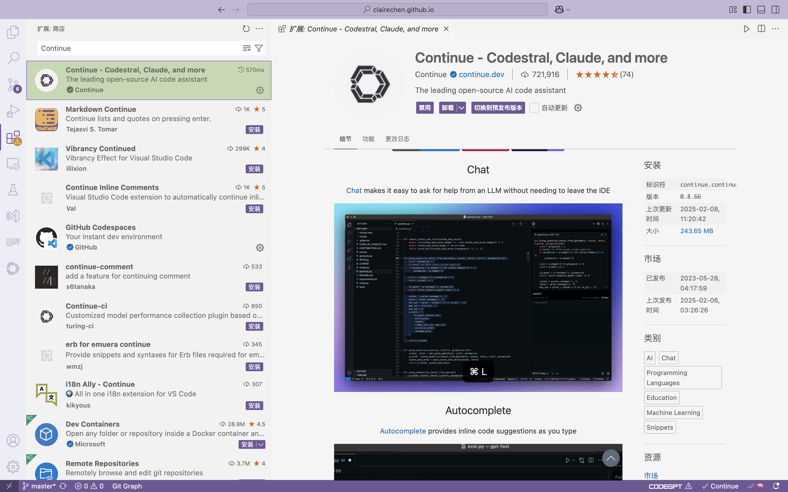
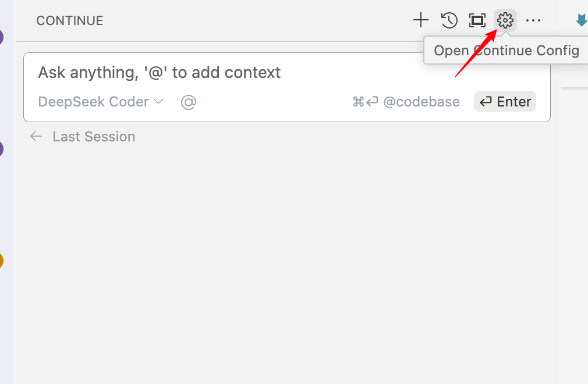
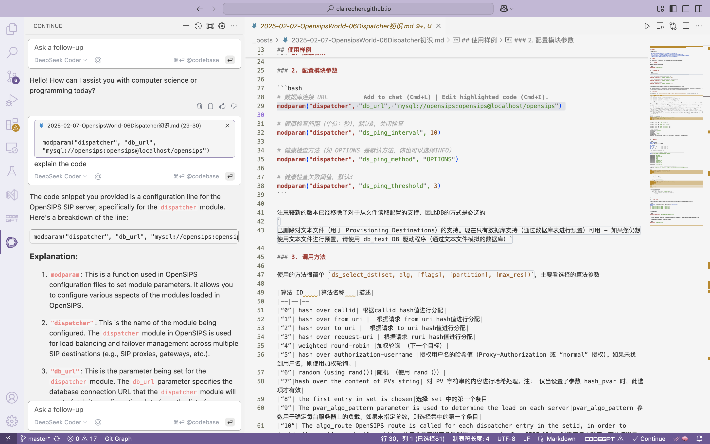
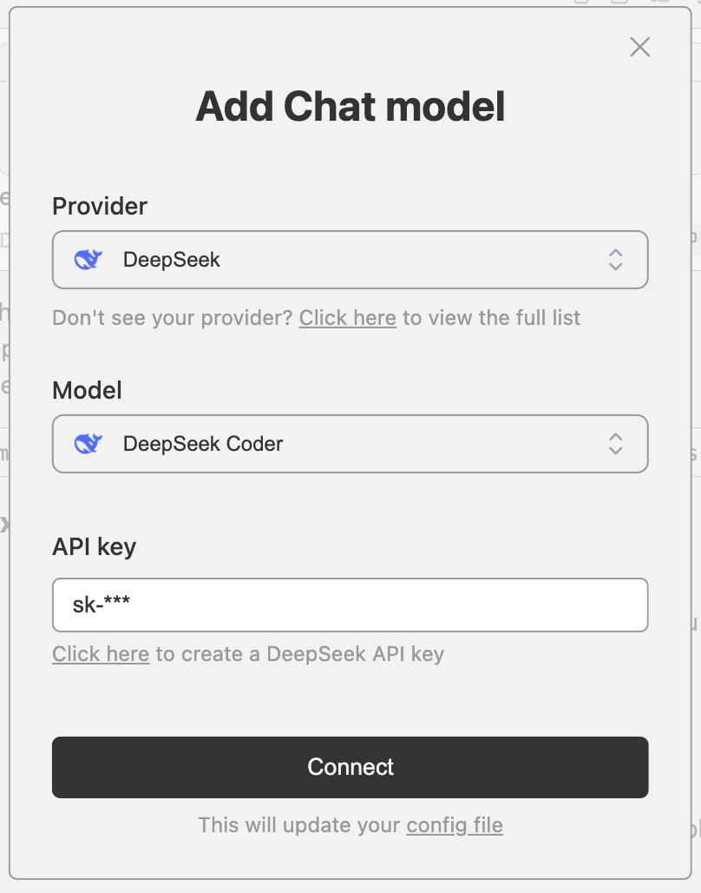

- [1. 准备工作](#1-准备工作)
- [2. 安装 Continue 插件](#2-安装-continue-插件)
- [3. 配置 DeepSeek API 密钥](#3-配置-deepseek-api-密钥)
- [4. 测试 DeepSeek 接入](#4-测试-deepseek-接入)
- [5. 新增配置](#5-新增配置)

### 1. 准备工作

安装 VSCode：确保已安装 Visual Studio Code。

提前在 deepseek 开放平台注册账号并登录，获取 DeepSeek API 密钥：注册 DeepSeek 账号并获取 API 密钥。


### 2. 安装 Continue 插件

打开 VSCode，进入 Extensions 视图（快捷键：Ctrl+Shift+X）。

搜索 Continue 插件。

点击 Install 安装插件，安装完成后重启 VSCode。



### 3. 配置 DeepSeek API 密钥

打开 VSCode，在左侧菜单栏找到 Continue，右上角点击配置



models中为核心的配置参数：

```json
"models": [
    {
      "title": "DeepSeek Coder",
      "model": "deepseek-coder",
      "contextLength": 128000,
      "apiKey": "sk-******",
      "provider": "deepseek"
    }
  ],
```

在 API Key 字段中，输入从 DeepSeek 获取的 API 密钥。

选择 DeepSeek 作为默认的 AI 模型（如果有多个选项）。

保存配置。

### 4. 测试 DeepSeek 接入

在 VSCode 中打开一个代码文件。



右键点击代码，选择 Continue 菜单中的 Explain Code 或 Generate Code。

观察 DeepSeek 的响应，确保接入成功。

### 5. 新增配置

可以依旧选择在json中手动添加，或者通过页面 Add Chat model的方式增加模型

