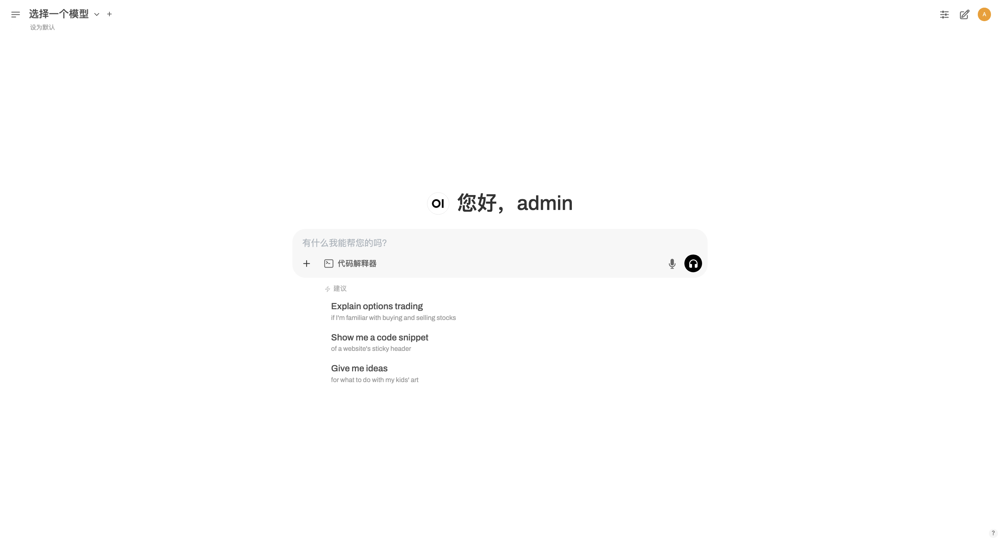
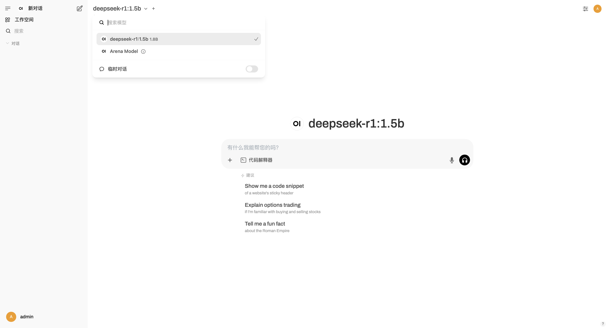
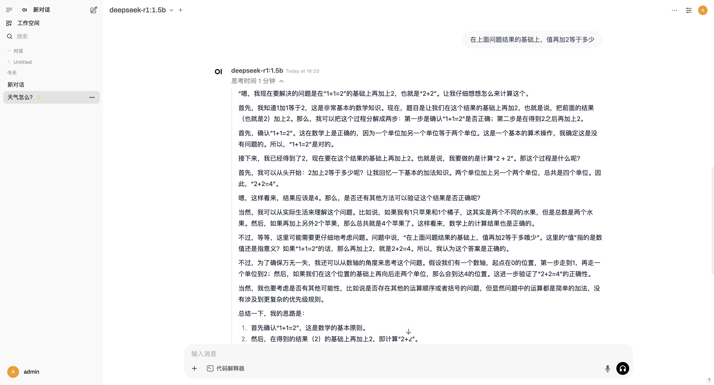
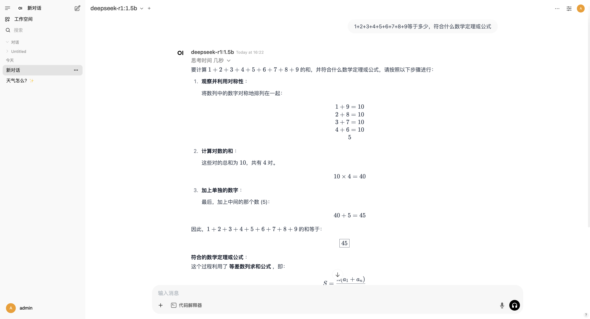

DeepSeek 很火爆，网页总会出现“系统繁忙”，除了去不同的平台入口寻求额外帮助，还可以本地化部署，独享性能。

我们需要用到：

- [Ollama](https://github.com/ollama/ollama): 启动并运行大型语言模型。star 125K
- [Open WebUI](https://github.com/open-webui/open-webui): 一个可扩展、功能丰富且用户友好的自托管 AI 平台，旨在完全离线运行。它支持各种 LLM 运行器，如 Ollama 和 OpenAI 兼容的 API，并内置了 RAG 推理引擎，使其成为强大的 AI 部署解决方案。star 72.4k
- [DeepSeek r1](https://github.com/deepseek-ai/DeepSeek-R1): 在数学、代码和推理任务方面的性能可与 OpenAI-o1 相媲美。star 72.3k
- [DeepSeek v3](https://github.com/deepseek-ai/DeepSeek-V3): 这是一个强大的专家混合 （MoE） 语言模型，总共有 671B 个参数，每个令牌激活了 37B。star 82.8k

目录概览：
- [如何选择 deepseek-r1和deepseek-v3](#如何选择-deepseek-r1和deepseek-v3)
- [如何部署](#如何部署)
  - [下载安装 Ollama](#下载安装-ollama)
    - [快速安装Ollama](#快速安装ollama)
    - [运行指令](#运行指令)
  - [拉取模型验证](#拉取模型验证)
  - [下载安装 Open Web UI](#下载安装-open-web-ui)
    - [如何安装](#如何安装)
  - [尝试页面使用](#尝试页面使用)

## 如何选择 deepseek-r1和deepseek-v3

1. 模型架构

    DeepSeek-R1：

- 可能是早期版本或基础版本。
- 使用较为传统的神经网络架构（如 RNN、LSTM 或早期的 Transformer）。
- 在性能和功能上可能较为基础。

    DeepSeek-V3：

- 可能是最新版本或优化版本。
- 使用更先进的架构（如 Transformer 的变体、BERT、GPT 等）。
- 在性能、准确性和功能上有显著提升。

2. 训练数据

    DeepSeek-R1：

- 可能使用了较小规模或较早期的训练数据集。
- 数据覆盖范围可能有限。

    DeepSeek-V3：

- 使用了更大规模、更多样化的训练数据。
- 数据更新至最新，覆盖更多领域和语言。

3. 性能优化

    DeepSeek-R1：

- 可能在推理速度、内存占用等方面未经过深度优化。
- 适合轻量级任务或资源有限的环境。

    DeepSeek-V3：

- 经过深度优化，推理速度更快，资源占用更低。
- 支持更复杂的任务和更大的规模。

4. 功能特性

    DeepSeek-R1：

- 功能较为基础，可能仅支持简单的文本生成、分类等任务。
- 缺乏对多模态（如图像、音频）的支持。

    DeepSeek-V3：

- 功能更丰富，支持多模态任务（如文本生成、图像理解、语音识别等）。
- 支持更复杂的交互逻辑（如上下文管理、多轮对话）。

5. 应用场景

    DeepSeek-R1：

- 适合简单的应用场景，如基础聊天机器人、文本分类等。
- 适合资源有限的环境（如嵌入式设备、移动端）。

    DeepSeek-V3：

- 适合复杂的应用场景，如智能客服、内容创作、多模态交互等。
- 适合高性能需求的环境（如云端服务、大规模部署）。

## 如何部署

### 下载安装 Ollama

#### 快速安装Ollama

1. visit `https://ollama.com/download`

2. Download for MacOS(Requires macOS 11 Big Sur or later)
download and install it.

3. after finished that, do it to check the version:

```bash
$ ollama -v
Warning: could not connect to a running Ollama instance
Warning: client version is 0.5.7
```

#### 运行指令

1. 以服务的形式启动一个后台服务，指定具体的端口，同时也可以指定具体加载的模型

```bash
ollama serve --port 12345

2025/02/11 16:51:50 routes.go:1187: INFO server config env="map[HTTPS_PROXY: HTTP_PROXY: NO_PROXY: OLLAMA_DEBUG:false OLLAMA_FLASH_ATTENTION:false OLLAMA_GPU_OVERHEAD:0 OLLAMA_HOST:http://127.0.0.1:11434 OLLAMA_KEEP_ALIVE:5m0s OLLAMA_KV_CACHE_TYPE: OLLAMA_LLM_LIBRARY: OLLAMA_LOAD_TIMEOUT:5m0s OLLAMA_MAX_LOADED_MODELS:0 OLLAMA_MAX_QUEUE:512 OLLAMA_MODELS:/Users/chenzy/.ollama/models OLLAMA_MULTIUSER_CACHE:false OLLAMA_NOHISTORY:false OLLAMA_NOPRUNE:false OLLAMA_NUM_PARALLEL:0 OLLAMA_ORIGINS:[http://localhost https://localhost http://localhost:* https://localhost:* http://127.0.0.1 https://127.0.0.1 http://127.0.0.1:* https://127.0.0.1:* http://0.0.0.0 https://0.0.0.0 http://0.0.0.0:* https://0.0.0.0:* app://* file://* tauri://* vscode-webview://*] OLLAMA_SCHED_SPREAD:false http_proxy: https_proxy: no_proxy:]"
time=2025-02-11T16:51:50.635+08:00 level=INFO source=images.go:432 msg="total blobs: 5"
time=2025-02-11T16:51:50.636+08:00 level=INFO source=images.go:439 msg="total unused blobs removed: 0"
[GIN-debug] [WARNING] Creating an Engine instance with the Logger and Recovery middleware already attached.

[GIN-debug] [WARNING] Running in "debug" mode. Switch to "release" mode in production.
 - using env:	export GIN_MODE=release
 - using code:	gin.SetMode(gin.ReleaseMode)

[GIN-debug] POST   /api/pull                 --> github.com/ollama/ollama/server.(*Server).PullHandler-fm (5 handlers)
[GIN-debug] POST   /api/generate             --> github.com/ollama/ollama/server.(*Server).GenerateHandler-fm (5 handlers)
[GIN-debug] POST   /api/chat                 --> github.com/ollama/ollama/server.(*Server).ChatHandler-fm (5 handlers)
[GIN-debug] POST   /api/embed                --> github.com/ollama/ollama/server.(*Server).EmbedHandler-fm (5 handlers)
[GIN-debug] POST   /api/embeddings           --> github.com/ollama/ollama/server.(*Server).EmbeddingsHandler-fm (5 handlers)
[GIN-debug] POST   /api/create               --> github.com/ollama/ollama/server.(*Server).CreateHandler-fm (5 handlers)
[GIN-debug] POST   /api/push                 --> github.com/ollama/ollama/server.(*Server).PushHandler-fm (5 handlers)
[GIN-debug] POST   /api/copy                 --> github.com/ollama/ollama/server.(*Server).CopyHandler-fm (5 handlers)
[GIN-debug] DELETE /api/delete               --> github.com/ollama/ollama/server.(*Server).DeleteHandler-fm (5 handlers)
[GIN-debug] POST   /api/show                 --> github.com/ollama/ollama/server.(*Server).ShowHandler-fm (5 handlers)
[GIN-debug] POST   /api/blobs/:digest        --> github.com/ollama/ollama/server.(*Server).CreateBlobHandler-fm (5 handlers)
[GIN-debug] HEAD   /api/blobs/:digest        --> github.com/ollama/ollama/server.(*Server).HeadBlobHandler-fm (5 handlers)
[GIN-debug] GET    /api/ps                   --> github.com/ollama/ollama/server.(*Server).PsHandler-fm (5 handlers)
[GIN-debug] POST   /v1/chat/completions      --> github.com/ollama/ollama/server.(*Server).ChatHandler-fm (6 handlers)
[GIN-debug] POST   /v1/completions           --> github.com/ollama/ollama/server.(*Server).GenerateHandler-fm (6 handlers)
[GIN-debug] POST   /v1/embeddings            --> github.com/ollama/ollama/server.(*Server).EmbedHandler-fm (6 handlers)
[GIN-debug] GET    /v1/models                --> github.com/ollama/ollama/server.(*Server).ListHandler-fm (6 handlers)
[GIN-debug] GET    /v1/models/:model         --> github.com/ollama/ollama/server.(*Server).ShowHandler-fm (6 handlers)
[GIN-debug] GET    /                         --> github.com/ollama/ollama/server.(*Server).GenerateRoutes.func1 (5 handlers)
[GIN-debug] GET    /api/tags                 --> github.com/ollama/ollama/server.(*Server).ListHandler-fm (5 handlers)
[GIN-debug] GET    /api/version              --> github.com/ollama/ollama/server.(*Server).GenerateRoutes.func2 (5 handlers)
[GIN-debug] HEAD   /                         --> github.com/ollama/ollama/server.(*Server).GenerateRoutes.func1 (5 handlers)
[GIN-debug] HEAD   /api/tags                 --> github.com/ollama/ollama/server.(*Server).ListHandler-fm (5 handlers)
[GIN-debug] HEAD   /api/version              --> github.com/ollama/ollama/server.(*Server).GenerateRoutes.func2 (5 handlers)
time=2025-02-11T16:51:50.640+08:00 level=INFO source=routes.go:1238 msg="Listening on 127.0.0.1:11434 (version 0.5.7)"
time=2025-02-11T16:51:50.642+08:00 level=INFO source=routes.go:1267 msg="Dynamic LLM libraries" runners=[cpu]
time=2025-02-11T16:51:50.643+08:00 level=INFO source=types.go:131 msg="inference compute" id="" library=cpu variant=avx2 compute="" driver=0.0 name="" total="8.0 GiB" available="1.7 GiB"


```

2. 快速前台启动并对话模型

```bash
ollama run deepseek-r1:1.5b

pulling manifest 
pulling aabd4debf0c8... 100% ▕████████████████████████████████████████████████████████████████████████████████████████████████████████████████████████████████████████████▏ 1.1 GB                         
pulling 369ca498f347... 100% ▕████████████████████████████████████████████████████████████████████████████████████████████████████████████████████████████████████████████▏  387 B                         
pulling 6e4c38e1172f... 100% ▕████████████████████████████████████████████████████████████████████████████████████████████████████████████████████████████████████████████▏ 1.1 KB                         
pulling f4d24e9138dd... 100% ▕████████████████████████████████████████████████████████████████████████████████████████████████████████████████████████████████████████████▏  148 B                         
pulling a85fe2a2e58e... 100% ▕████████████████████████████████████████████████████████████████████████████████████████████████████████████████████████████████████████████▏  487 B                         
verifying sha256 digest 
writing manifest 
success 
>>> hello
<think>
```

### 拉取模型验证

```bash
$ ollama run deepseek-r1:1.5b
pulling manifest 
pulling aabd4debf0c8...  88% ▕█████████████████████
```

不同模型对于不同粒度、能力以及占用空间，根据自己需求和实际情况选择

```bash
$ ollama run deepseek-r1:1.5b
pulling manifest 
pulling aabd4debf0c8... 100% ▕████████████████████████████████████████████████████████████████████████████████████████████████████████████████████████████████████████████▏ 1.1 GB                         
pulling 369ca498f347... 100% ▕████████████████████████████████████████████████████████████████████████████████████████████████████████████████████████████████████████████▏  387 B                         
pulling 6e4c38e1172f... 100% ▕████████████████████████████████████████████████████████████████████████████████████████████████████████████████████████████████████████████▏ 1.1 KB                         
pulling f4d24e9138dd... 100% ▕████████████████████████████████████████████████████████████████████████████████████████████████████████████████████████████████████████████▏  148 B                         
pulling a85fe2a2e58e... 100% ▕████████████████████████████████████████████████████████████████████████████████████████████████████████████████████████████████████████████▏  487 B                         
verifying sha256 digest 
writing manifest 
success 
>>> hello
<think>

</think>

Hello! How can I assist you today? 😊

>>> Send a message (/? for help)


```

运行完后直接进行对话

### 下载安装 Open Web UI

#### 如何安装

Installation via Python pip 🐍
Open WebUI can be installed using pip, the Python package installer. Before proceeding, ensure you're using` Python 3.11` to avoid compatibility issues.

Install Open WebUI: Open your terminal and run the following command to install Open WebUI:

pip install open-webui
Running Open WebUI: After installation, you can start Open WebUI by executing:`open-webui serve`

```bash
$ open-webui serve
Loading WEBUI_SECRET_KEY from file, not provided as an environment variable.
Generating a new secret key and saving it to /Users/chenzy/.webui_secret_key
Loading WEBUI_SECRET_KEY from /Users/chenzy/.webui_secret_key
/usr/local/lib/python3.11/site-packages/open_webui
/usr/local/lib/python3.11/site-packages
/usr/local/lib/python3.11
Running migrations
INFO  [alembic.runtime.migration] Context impl SQLiteImpl.
INFO  [alembic.runtime.migration] Will assume non-transactional DDL.
INFO  [alembic.runtime.migration] Running upgrade  -> 7e5b5dc7342b, init
INFO  [alembic.runtime.migration] Running upgrade 7e5b5dc7342b -> ca81bd47c050, Add config table
INFO  [alembic.runtime.migration] Running upgrade ca81bd47c050 -> c0fbf31ca0db, Update file table
INFO  [alembic.runtime.migration] Running upgrade c0fbf31ca0db -> 6a39f3d8e55c, Add knowledge table
Creating knowledge table
Migrating data from document table to knowledge table
INFO  [alembic.runtime.migration] Running upgrade 6a39f3d8e55c -> 242a2047eae0, Update chat table
Converting 'chat' column to JSON
Renaming 'chat' column to 'old_chat'
Adding new 'chat' column of type JSON
Dropping 'old_chat' column
INFO  [alembic.runtime.migration] Running upgrade 242a2047eae0 -> 1af9b942657b, Migrate tags
INFO  [alembic.runtime.migration] Running upgrade 1af9b942657b -> 3ab32c4b8f59, Update tags
Primary Key: {'name': None, 'constrained_columns': []}
Unique Constraints: [{'name': 'uq_id_user_id', 'column_names': ['id', 'user_id']}]
Indexes: [{'name': 'tag_id', 'column_names': ['id'], 'unique': 1, 'dialect_options': {}}]
Creating new primary key with 'id' and 'user_id'.
Dropping unique constraint: uq_id_user_id
Dropping unique index: tag_id
INFO  [alembic.runtime.migration] Running upgrade 3ab32c4b8f59 -> c69f45358db4, Add folder table
INFO  [alembic.runtime.migration] Running upgrade c69f45358db4 -> c29facfe716b, Update file table path
INFO  [alembic.runtime.migration] Running upgrade c29facfe716b -> af906e964978, Add feedback table
INFO  [alembic.runtime.migration] Running upgrade af906e964978 -> 4ace53fd72c8, Update folder table and change DateTime to BigInteger for timestamp fields
INFO  [alembic.runtime.migration] Running upgrade 4ace53fd72c8 -> 922e7a387820, Add group table
INFO  [alembic.runtime.migration] Running upgrade 922e7a387820 -> 57c599a3cb57, Add channel table
INFO  [alembic.runtime.migration] Running upgrade 57c599a3cb57 -> 7826ab40b532, Update file table
INFO  [alembic.runtime.migration] Running upgrade 7826ab40b532 -> 3781e22d8b01, Update message & channel tables
INFO  [open_webui.env] 'DEFAULT_LOCALE' loaded from the latest database entry
INFO  [open_webui.env] 'DEFAULT_PROMPT_SUGGESTIONS' loaded from the latest database entry
WARNI [open_webui.env] 

WARNING: CORS_ALLOW_ORIGIN IS SET TO '*' - NOT RECOMMENDED FOR PRODUCTION DEPLOYMENTS.

INFO  [open_webui.env] Embedding model set: sentence-transformers/all-MiniLM-L6-v2
/usr/local/lib/python3.11/site-packages/pydub/utils.py:170: RuntimeWarning: Couldn't find ffmpeg or avconv - defaulting to ffmpeg, but may not work
  warn("Couldn't find ffmpeg or avconv - defaulting to ffmpeg, but may not work", RuntimeWarning)
WARNI [langchain_community.utils.user_agent] USER_AGENT environment variable not set, consider setting it to identify your requests.


  ___                    __        __   _     _   _ ___
 / _ \ _ __   ___ _ __   \ \      / /__| |__ | | | |_ _|
| | | | '_ \ / _ \ '_ \   \ \ /\ / / _ \ '_ \| | | || |
| |_| | |_) |  __/ | | |   \ V  V /  __/ |_) | |_| || |
 \___/| .__/ \___|_| |_|    \_/\_/ \___|_.__/ \___/|___|
      |_|


v0.5.10 - building the best open-source AI user interface.

https://github.com/open-webui/open-webui

1_Pooling/config.json: 100%|████████████████████████████████████████████████████████████████████████████████████████████████████████████████████████████████████████████████| 190/190 [00:00<00:00, 655kB/s]
modules.json: 100%|█████████████████████████████████████████████████████████████████████████████████████████████████████████████████████████████████████████████████████████| 349/349 [00:00<00:00, 925kB/s]
.gitattributes: 100%|██████████████████████████████████████████████████████████████████████████████████████████████████████████████████████████████████████████████████| 1.23k/1.23k [00:00<00:00, 4.11MB/s]
config_sentence_transformers.json: 100%|████████████████████████████████████████████████████████████████████████████████████████████████████████████████████████████████████| 116/116 [00:00<00:00, 599kB/s]
config.json: 100%|█████████████████████████████████████████████████████████████████████████████████████████████████████████████████████████████████████████████████████████| 612/612 [00:00<00:00, 2.22MB/s]
data_config.json: 100%|█████████████████████████████████████████████████████████████████████████████████████████████████████████████████████████████████████████████████| 39.3k/39.3k [00:00<00:00, 851kB/s]
README.md: 100%|███████████████████████████████████████████████████████████████████████████████████████████████████████████████████████████████████████████████████████| 10.7k/10.7k [00:00<00:00, 29.5MB/s]
model_O4.onnx: 100%|███████████████████████████████████████████████████████████████████████████████████████████████████████████████████████████████████████████████████| 45.2M/45.2M [00:07<00:00, 6.05MB/s]
model_qint8_arm64.onnx: 100%|██████████████████████████████████████████████████████████████████████████████████████████████████████████████████████████████████████████| 23.0M/23.0M [00:08<00:00, 2.74MB/s]
openvino/openvino_model.xml: 100%|████████████████████████████████████████████████████████████████████████████████████████████████████████████████████████████████████████| 211k/211k [00:00<00:00, 661kB/s]
openvino_model_qint8_quantized.bin: 100%|██████████████████████████████████████████████████████████████████████████████████████████████████████████████████████████████| 22.9M/22.9M [00:04<00:00, 4.85MB/s]
(…)nvino/openvino_model_qint8_quantized.xml: 100%|████████████████████████████████████████████████████████████████████████████████████████████████████████████████████████| 368k/368k [00:00<00:00, 590kB/s]
model_quint8_avx2.onnx: 100%|██████████████████████████████████████████████████████████████████████████████████████████████████████████████████████████████████████████| 23.0M/23.0M [00:13<00:00, 1.67MB/s]
pytorch_model.bin: 100%|███████████████████████████████████████████████████████████████████████████████████████████████████████████████████████████████████████████████| 90.9M/90.9M [01:08<00:00, 1.34MB/s]
sentence_bert_config.json: 100%|██████████████████████████████████████████████████████████████████████████████████████████████████████████████████████████████████████████| 53.0/53.0 [00:00<00:00, 227kB/s]
special_tokens_map.json: 100%|██████████████████████████████████████████████████████████████████████████████████████████████████████████████████████████████████████████████| 112/112 [00:00<00:00, 612kB/s]
model_O2.onnx: 100%|████████████████████████████████████████████████████████████████████████████████████████████████████████████████████████████████████████████████████| 90.3M/90.3M [01:35<00:00, 942kB/s]
model_O1.onnx: 100%|████████████████████████████████████████████████████████████████████████████████████████████████████████████████████████████████████████████████████| 90.4M/90.4M [01:36<00:00, 934kB/s]
tokenizer.json: 100%|████████████████████████████████████████████████████████████████████████████████████████████████████████████████████████████████████████████████████| 466k/466k [00:00<00:00, 1.61MB/s]
train_script.py: 100%|█████████████████████████████████████████████████████████████████████████████████████████████████████████████████████████████████████████████████| 13.2k/13.2k [00:00<00:00, 14.4MB/s]
tokenizer_config.json: 100%|███████████████████████████████████████████████████████████████████████████████████████████████████████████████████████████████████████████████| 350/350 [00:00<00:00, 2.12MB/s]
vocab.txt: 100%|█████████████████████████████████████████████████████████████████████████████████████████████████████████████████████████████████████████████████████████| 232k/232k [00:00<00:00, 1.00MB/s]
openvino_model.bin: 100%|██████████████████████████████████████████████████████████████████████████████████████████████████████████████████████████████████████████████| 90.3M/90.3M [01:28<00:00, 1.02MB/s]
rust_model.ot: 100%|███████████████████████████████████████████████████████████████████████████████████████████████████████████████████████████████████████████████████| 90.9M/90.9M [01:18<00:00, 1.16MB/s]
model.onnx: 100%|███████████████████████████████████████████████████████████████████████████████████████████████████████████████████████████████████████████████████████| 90.4M/90.4M [01:43<00:00, 872kB/s]
model_O3.onnx: 100%|████████████████████████████████████████████████████████████████████████████████████████████████████████████████████████████████████████████████████| 90.3M/90.3M [01:43<00:00, 872kB/s]
model.safetensors: 100%|████████████████████████████████████████████████████████████████████████████████████████████████████████████████████████████████████████████████| 90.9M/90.9M [01:47<00:00, 846kB/s]
tf_model.h5: 100%|█████████████████████████████████████████████████████████████████████████████████████████████████████████████████████████████████████████████████████| 91.0M/91.0M [00:24<00:00, 3.78MB/s]
Fetching 30 files: 100%|████████████████████████████████████████████████████████████████████████████████████████████████████████████████████████████████████████████████████| 30/30 [01:53<00:00,  3.79s/it]
INFO:     Started server process [41445]███████████████████████████████████████████████████████████████████████████████████████████████████████████████████████████████| 90.9M/90.9M [01:47<00:00, 1.57MB/s]
INFO:     Waiting for application startup.█████████████████████████████████████████████████████████████████████████████████████████████████████████████████████████████| 90.3M/90.3M [01:43<00:00, 1.35MB/s]
INFO:     Application startup complete.█████████████▎                                                                                                                  | 21.0M/91.0M [00:15<00:47, 1.47MB/s]
INFO:     Uvicorn running on http://0.0.0.0:8080 (Press CTRL+C to quit)
tf_model.h5:  46%|████████████████████████████████████████████████████████████████████▋                                                                                | 41.9M/91.0M [00:19<00:16, 2.89MB/s]
tf_model.h5: 100%|█████████████████████████████████████████████████████████████████████████████████████████████████████████████████████████████████████████████████████| 91.0M/91.0M [00:24<00:00, 7.60MB/s]
```
This will start the Open WebUI server, which you can access at `http://localhost:8080`



此外docker K8S的方式更适合正式的场合或者是生产

```bash
docker run -d -p 3000:8080 --add-host=host.docker.internal:host-gateway -v open-webui:/app/backend/data --name open-webui --restart always ghcr.io/open-webui/open-webui:main
```

### 尝试页面使用

启动了deepseek模型并启动了 open webui后，页面能够自动链接上模型



之类类似于官网，直接开始提问




选取的模型、响应的速率，取决于你自身需求和自身环境条件，这里指提供基础的展示。
